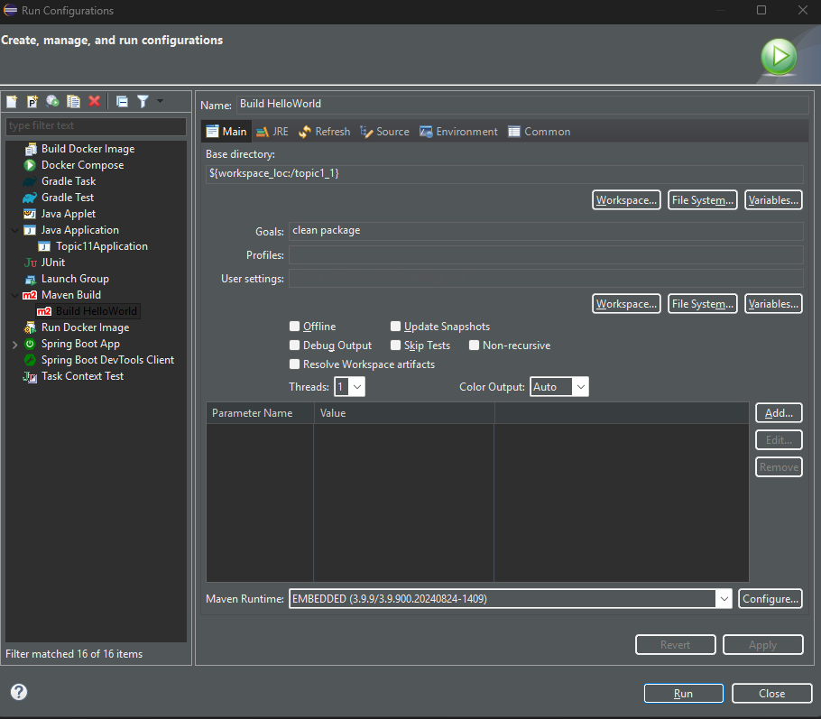
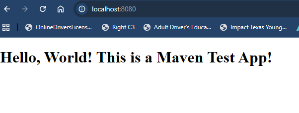

# Activity 1

## This is **CST339 - Activity 1 - Introduction to Spring Boot**

# Part 1
## Screenshots

- This is screenshot of the Spring Tool About

- This is a screenshot of console output when running the Topic11Application class.

- This is a screenshot of the Whitelabel Error Page.

- This is a screenshot of the Hello World index.html page

# Part 2
## Screenshots

- This is a screenshot of the Maven Build configurations.

- This is a screenshot of the Maven Console, with a **BUILD SUCCESS**.

- This is a screenshot of the Java ARchive (JAR) file Execution.

- This is a screenshot of the Hello World index.html page.

## Research Questions:

### 1.) Research Spring Boot. Compare building dynamic web applications when using Spring Boot versus just using the Spring framework. How do they differ?

- Spring Boot is a Java framework that enhances the Spring framework to simplify application development. It minimizes the need for boilerplate code by utilizing its auto-configuration feature. With an embedded server, Spring Boot enables applications to be ready for production right from the beginning. It supports various types of applications, including web applications, REST APIs, microservices, security features, and easy cloud deployment. Essentially, while the Spring framework offers a comprehensive set of tools, Spring Boot acts as a pre-built template that manages the complex setup for you. This allows developers to build and launch dynamic applications much more quickly. Several compelling reasons to learn Spring Boot include its rapid development capabilities, which allow for the quick creation of applications with minimal configuration, as well as its seamless integration with databases, security, messaging, and cloud platforms.

### 2.) Research Gradle, which is another popular build and dependency management tool. How does it differ from Maven?

- Gradle is a modern build tool that stands out from Maven primarily due to its performance and flexibility. While Maven relies on a rigid, XML-based "Project Object Model" (pom.xml) that adheres to strict conventions, Gradle employs a Groovy or Kotlin-based Domain Specific Language (DSL) in its build scripts (build.gradle). This results in more concise scripts and the ability to implement complex, custom build logic. In terms of performance, Gradle is significantly faster because it utilizes incremental builds and a build cache to avoid re-running tasks that haven’t changed. In contrast, Maven often recompiles entire modules, which can slow down the build process. To summarize, Maven is more suitable for standardized, straightforward projects, while Gradle is the preferred option for large-scale, high-performance, or highly customized applications, such as Android development.

## Conclusion:

- In this activity, we set up and validated our Spring development environment by configuring Spring Tool Suite with the appropriate Java runtime and generating a basic Spring Boot project. We confirmed that the application ran successfully by reviewing the console startup output and printing a custom "Hello" message from the main() method. Next, we verified Spring Boot's default behavior by observing the Whitelabel Error Page when no home resource was available. To resolve this, we added a static index.html file under src/main/resources/static, allowing the application to serve content at localhost:8080. Finally, we learned how to stop and rebuild the application so that changes are packaged into the runnable JAR and reflected when running the project outside the IDE.
