# Activity 2

## This is **CST339 - Activity 2  - Spring Model View Controller (MVC)**

# Part 1: Creating Models, Views, and Controllers Using Spring MVC
## Screenshots

- This is a screenshot of the MVC test screen 1: First controller "Test 1"

- This is a screenshot of the MVC test screen 2: Second Controller "Test 2"

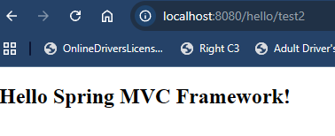

- This is a screenshot of the MVC test screen 3: Third Contoller "Test 3"

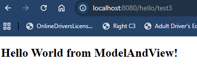

- Screenshot of the MVC test screen 4: Anchor tag added of "Test 4" that leads to contoller "Test 4"

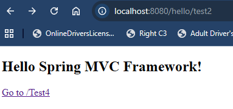

- *Part 2 of MVC test screen 4 with Tymeleaf*

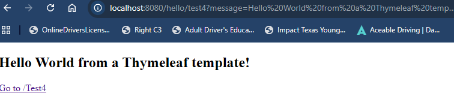

- This is a screenshot of the MVC test screen 5 with added anchors to test 2 and 3

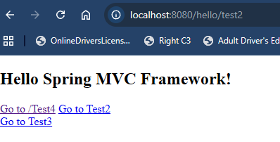

- This is a screenshot of the MVC test screen 6 with controllor test 2 anchor link

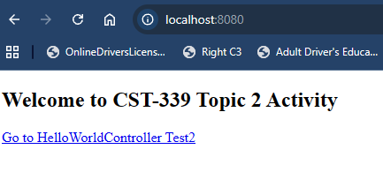

# Part 2: Creating Forms with Data Validation Using Spring MVC
## Screenshots

- This is a screenshot of the Login page test message

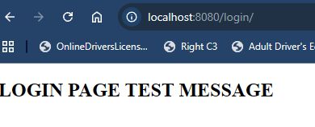

- This is a screenshot of the Login Form with no data validation

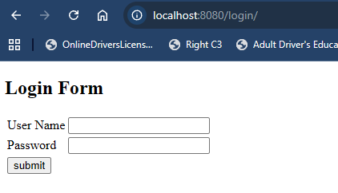

- This is a screenshot of the doLogin test 'Order Page'

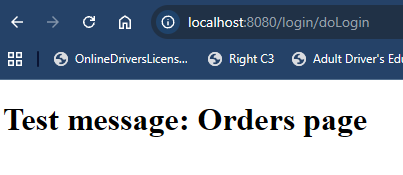

- This is a screenshot of the My Orders Console page

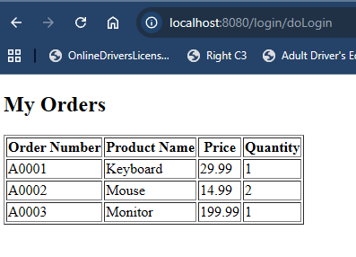

- This is a screenshot of the Login Form with data validation errors

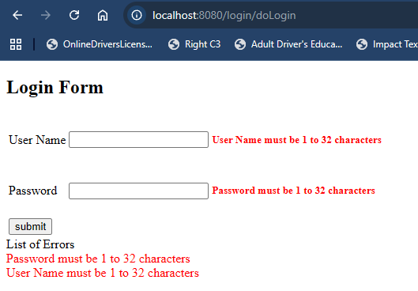

# Part 3: Creating Layouts Using Thymeleaf
## Screenshots

- This is a screenshot of the Login Page

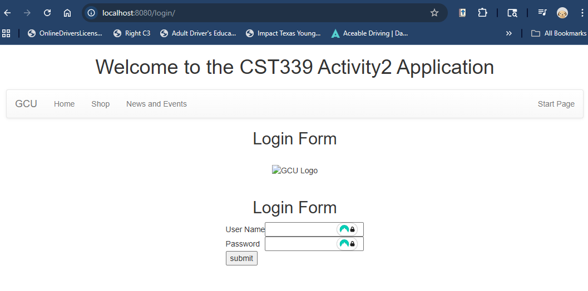

- This is a screenshot of the Orders Page

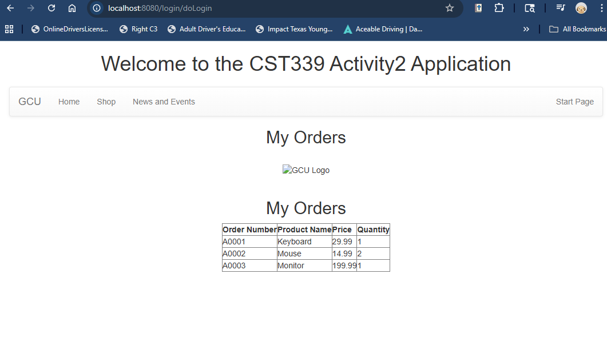

## Research Questions:

### 1.) How does Spring MVC support the MVC design pattern? Draw a diagram that supports the answer to this question.

- Spring MVC effectively implements the Model-View-Controller pattern through a central component known as the DispatcherServlet, which operates as a "front controller" to manage all incoming requests. When a user submits a request, the DispatcherServlet decisively routes it to the appropriate Controller. The Controller processes the request data (the Model) and promptly returns it to a View, which displays the information as a webpage for the user. This clear separation of data, logic, and presentation not only enhances code organization but also significantly simplifies the process of making updates.

#### Mermaid Diagram:

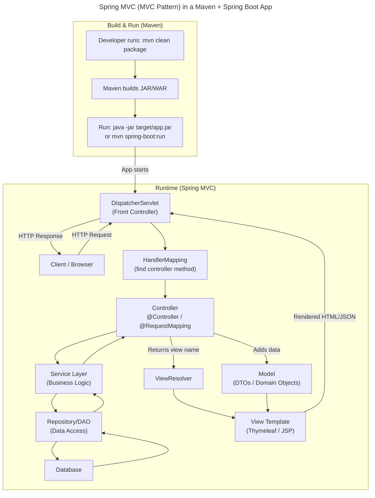

### 2.) Research and identify 2 MVC Frameworks other than Spring MVC. What are the frameworks and how do they differ from Spring MVC?

- Two leading alternatives to Spring MVC are Django, which is based on Python, and Ruby on Rails, based on Ruby. Both frameworks utilize the MVC (Model-View-Controller) pattern but adopt different philosophies that make them stand out. Django takes a "batteries-included" approach, delivering a built-in admin interface and a powerful Object-Relational Mapping (ORM) system straight out of the box. In contrast, Spring MVC often necessitates extra modules, such as Spring Data, to provide similar capabilities.

    Ruby on Rails, on the other hand, has set the standard with its "Convention over Configuration" principle. This principle streamlines development by automating numerous tasks through strict naming conventions, allowing for rapid prototyping that outpaces the more explicit and verbose configuration typical of Spring MVC.

    While Spring MVC is highly effective in high-performance enterprise Java environments, Django and Ruby on Rails are undeniably the go-to choices for speed and ease of use in smaller to medium-sized projects.

## Conclusion:

- In this activity, we built a working Spring Boot MVC application by creating controllers, views, and models and then improving the structure using Thymeleaf layouts. We started by configuring component scanning and creating controller endpoints to confirm routing worked correctly, first returning raw text with @ResponseBody, then returning Thymeleaf views while passing data through the Model and ModelAndView. Next, we implemented a login feature by building a LoginModel, binding it to a Thymeleaf form using th:object and th:field, and handling the form submission with a POST controller that loads an Orders page populated with a default list of OrderModel objects. We also added server-side validation using @Valid and BindingResult, along with constraint annotations like @NotNull and @Size, and displayed field-level and page-level error messages in the login view when invalid input was submitted. Finally, we created reusable page layouts by using a shared template and fragment files (header/footer), allowing the login and orders pages to inherit a consistent design without duplicating code, making the project cleaner, more maintainable, and ready to package and run as a proper Spring Boot application.
