# Activity 2

## This is **CST339 - Activity 3  - Spring Bean Services using Spring Core**

# Part 1: Creating Spring Bean Services Using Spring Core
## Screenshots

- This is a screenshot of the Interface being called

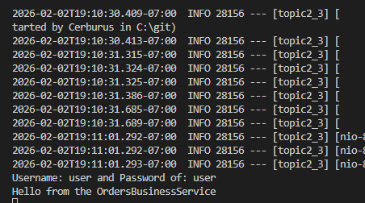

- This is a screenshot of the Another Interface being called

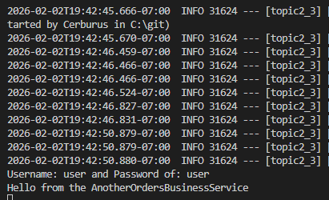

- This is a screenshot of the Authenticate being called

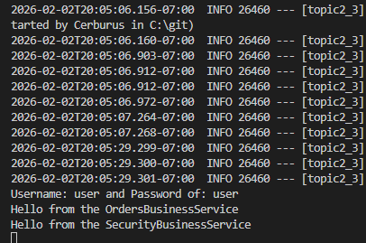

- This is a screenshot of the Orders page

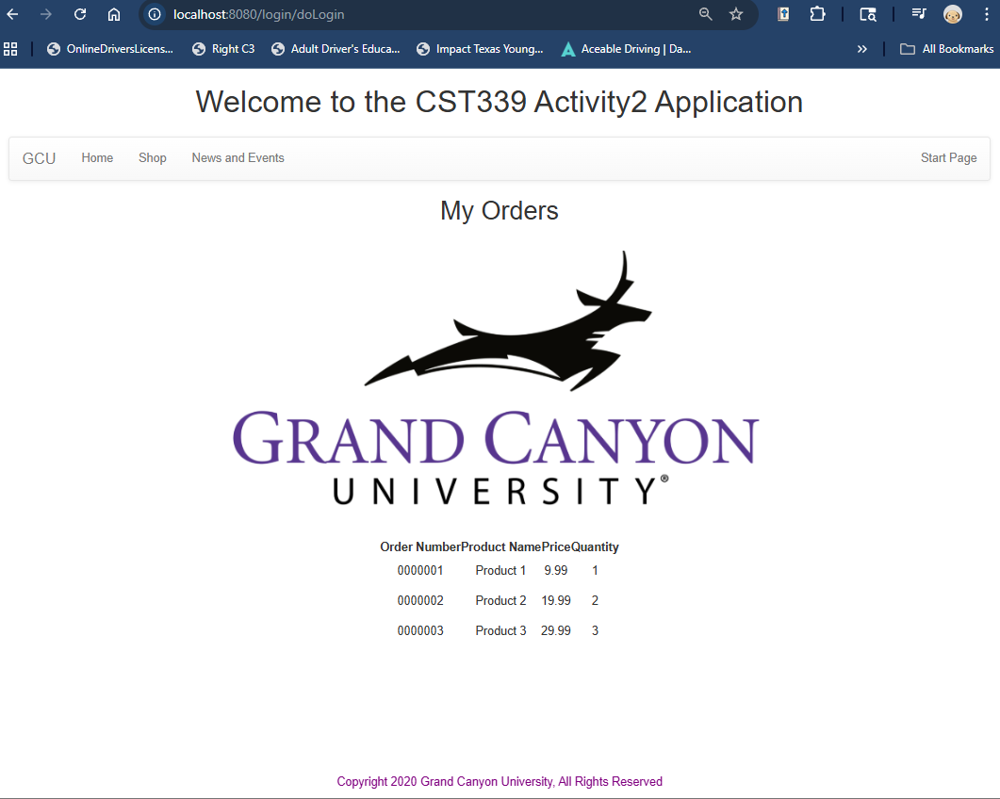

# Part 2: Spring Bean Life Cycle and Scopes
## Screenshots

- This is a screenshot of the init method call (Singltone Form)

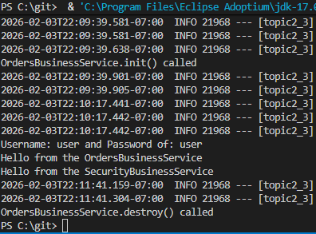

- This is a screenshot of the @Scope annotation for the first prototype

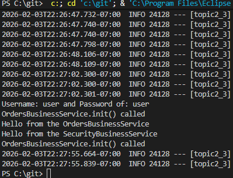

- This is a screenshot of the @RequestScope annotation

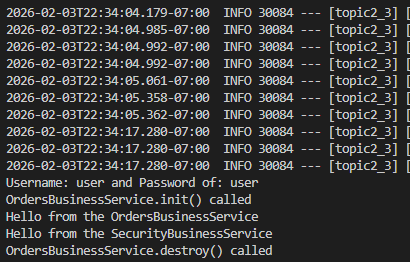

- This is a screenshot of the @SessionScope annotation

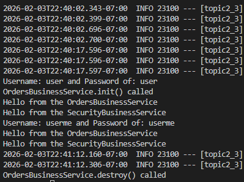

# Part 3: Creating REST Services Using Spring REST Controllers
## Screenshots

- This is a screenshot of the JSON response

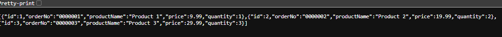

- This is a screenshot of the XML response

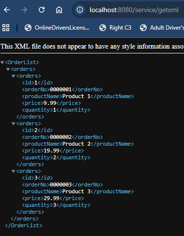

- This is a screenshot of the Postman JSON response

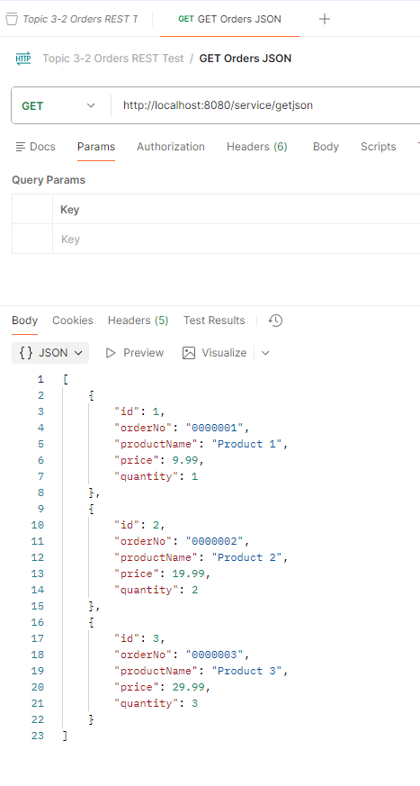

- This is a screenshot of the Postman XML response

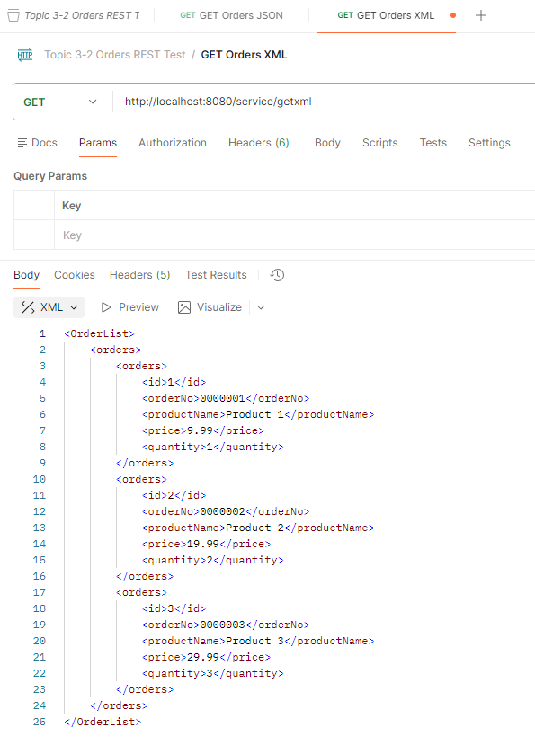

## Research Questions:

### What is the difference between the @Component, @Service, and @Bean annotations? When you would use one versus the other?:
- The @Component An annotation is a general-purpose marker that you can place on any Java class to inform Spring, "Please manage this for me." In contrast, @Service serves a similar purpose but is specifically designated for classes that contain your business logic, essentially the rules governing how your application operates. This distinction helps make your code more readable. While both annotations apply to your own classes, the @Bean annotation is used within a configuration file when you need to integrate and customize a class created by someone else or when you require more manual control over the object creation process.

### Why does an inversion of control (IoC) container force you to design and code to interface contracts?:
- An Inversion of Control (IoC) container is an essential middleman that provides your code with the necessary tools it needs. To perform effectively, the container must grasp the "shape" of these tools without being tied to a specific brand. When you code directly to a specific class, you limit yourself to that version. Instead, by coding to an interface, you create a "universal plug" that offers flexibility. This approach mandates a clear contract through the interface, enabling the IoC container to seamlessly swap in different versions of a service. For instance, you can effortlessly switch from a real database to a test database without rewriting your entire application. Embrace this design to enhance your project's adaptability and maintainability.

## Conclusion

- In Part 1, we learned how Spring creates and manages business services using Spring Beans, the IoC container, and dependency injection. We developed an interface-based service, integrated it into the LoginController using the @Autowired annotation, and demonstrated that we could switch implementations simply by changing the bean returned in the Spring configuration. Additionally, we introduced a SecurityBusinessService using the @Service annotation and moved the orders list from the controller to the business layer, allowing the controller to focus solely on handling requests and views. In Part 2, we explored the Spring Bean lifecycle and bean scopes by adding init() and destroy() methods and linking them through the @Bean(initMethod=..., destroyMethod=...) settings. We compared how frequently the init() method was called under different scopes: singleton (one instance for the entire application), prototype (a new instance created whenever requested), request (a new instance for each HTTP request), and session (a new instance for each browser session). This comparison helped us understand how scope affects when and how often Spring creates service objects. In Part 3, we created a simple REST API using a Spring @RestController and exposed the same order data in two formats: JSON and XML. We added XML support, created an OrderList wrapper for XML output, and built two endpoints (/service/getjson and /service/getxml) to return the orders in each format. Finally, we documented the API design and tested the endpoints using both a web browser and Postman, confirming that the REST service functions correctly and returns the expected responses.