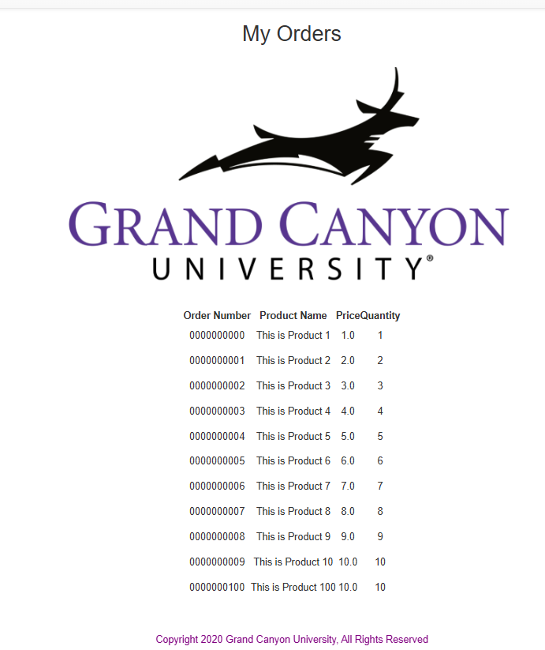
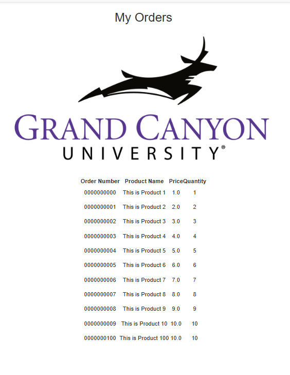
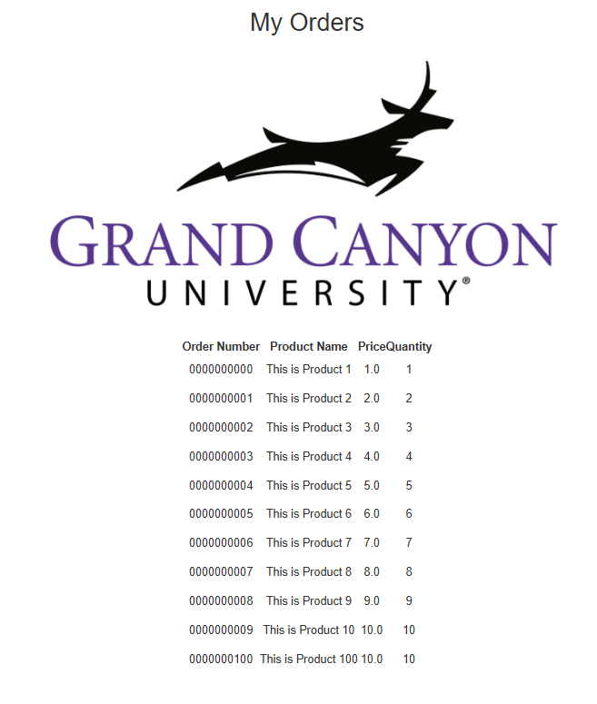

# Activity 4

## This is **CST339 - Activity 4  - Spring JDBC**

# Part 1: Creating Data Services Using Spring JDBC
## Screenshots

- This is a screenshot of the Orders Page

# Part 2: Creating Data Services Using Spring Data JDBC
## Screenshots

- This is a screenshot of the Orders Page

# Part 3:  Creating Data Services Using Spring Data JDBC Native Queries
## Screenshots

- This is a screenshot of the Orders Page

## Research Questions:

### How does Spring Data JDBC differ from standard Java JDBC programming?:
- Standard JDBC is like building a house from scratch, where you have to manually cut every piece of wood and turn every screw. This means you spend a lot of time writing repetitive code to open connections, handle errors, and transfer data from rows into Java objects. In contrast, Spring Data JDBC is like using a pre-built kit that takes care of all the essential setup for you. It automatically maps your database columns to your variables and provides built-in commands to save or retrieve data just by creating a simple interface. Unlike more complex tools like JPA, Spring Data JDBC doesn’t involve any “hidden magic.” When you instruct it to perform a task, it does so immediately and predictably, which results in cleaner code that is faster to write and easier to troubleshoot if something goes wrong.

### How does Spring Data JDBC support transaction management and the atomicity, consistency, isolation, and durability (ACID) principle?:
- Spring Data JDBC simplifies managing database changes by using the @Transactional annotation, which handles the underlying operations related to the ACID principles (Atomicity, Consistency, Isolation, and Durability). Instead of having to manually write code to start and complete a transaction, Spring ensures that a series of database operations either all succeed or none do, maintaining atomicity. It makes certain that your data adheres to all specified rules (consistency), prevents conflicts between different users’ changes (isolation), and guarantees that once a change is saved, it remains intact even in the event of a power failure (durability). By allowing the Spring container to manage database connections, you can avoid the complexities of opening and closing database links, which helps keep your data secure and your code clean and maintainable.

## Conclusion

- Activity 4 showed me how to connect a Spring Boot application to a MySQL database and retrieve real data using three methods: JDBC with SQL (Part 1), Spring Data JDBC repositories (Part 2), and a hybrid approach using native queries plus JdbcTemplate overrides (Part 3). This helped me understand different persistence patterns and how Spring’s dependency injection wires services and repositories together.