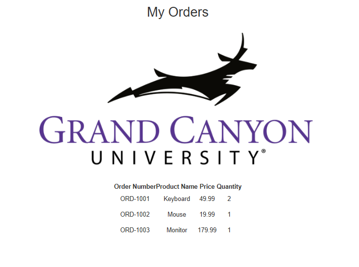
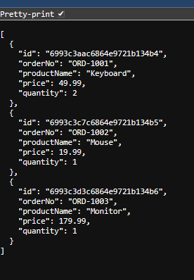
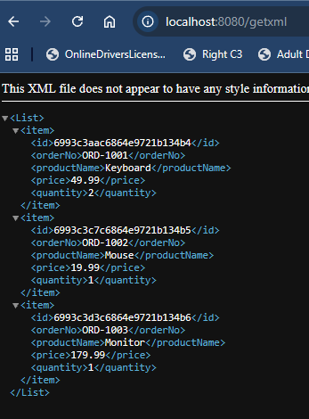
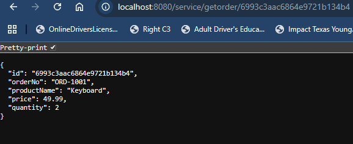
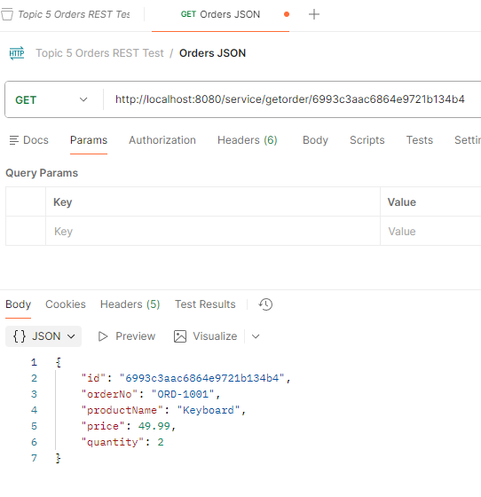
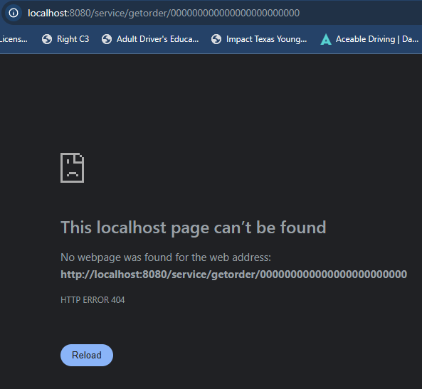
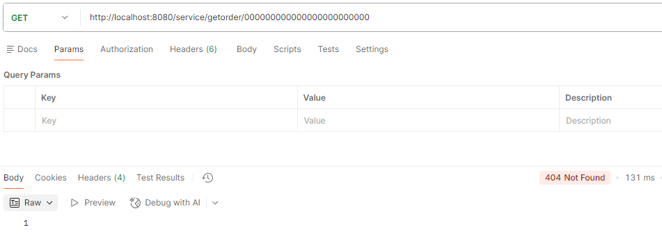

# CST339 - Activity 5 - Spring Data MongoDB

## Introduction

- This activity will provide the following:
  - Configure an application to use Spring Data MongoDB
  - Persist data using the Data Access Object (DAO)/Repository design pattern to a non-relational database using Spring Data MongoDB

## MongoDB

- [MongoDB Installation and Configuration](https://gitlab.com/bobby.estey/wikibob/-/blob/master/docs/database/mongodb/installation/README.md)
- [MongoDB Database Procedures](https://gitlab.com/bobby.estey/wikibob/-/blob/master/docs/database/mongodb/databaseProcedures/README.md)

## Screenshots

#### Part 1: Creating Data Services Using Spring Data MongoDB

- This is a screenshot of the Orders Page

- This is a screenshot of the JSON Page

- This is a screenshot of the XML Page

#### Part 2: Adding New Queries in the MongoDB Repository

- This is a screenshot of getOrder of a good ID in the Browser

- This is a screenshot of getOrder of a good ID in Postman

- This is a screenshot of getOrder of a bad ID in the Browser

- This is a screenshot of getOrder of a bad ID in Postman

## Research Questions

### Compare and contrast the design of schema in a relational database and a non-relational database. How do they differ, and what impacts does migrating from a relational database to a non-relational database have on your application design?:

Relational databases (**SQL**) utilize a fixed schema consisting of tables, rows, and columns. They enforce data integrity through strict relationships and normalization, which helps reduce redundancy. On the other hand, non-relational databases (NoSQL) employ flexible schemas, such as documents or key-value pairs. This flexibility enables the storage of various data structures together without a predefined blueprint. Migrating from a relational database to a non-relational one requires a significant shift in application design. Instead of joining tables at query time, you would nest data inside objects (a process known as denormalization). As a result, your application takes on the responsibility for ensuring data consistency that the database once managed. However, this trade-off grants you the advantages of horizontal scalability and the ability to handle rapidly changing data types more easily.

### How does Spring Data support transaction management and the ACID principle?:

Spring Data effectively manages transactions through the @Transactional annotation, which is integral to Spring's core abstraction layer. This framework rigorously applies the ACID principles to ensure robust data integrity.

- **Atomicity** is uncompromisingly enforced by wrapping all database operations in an "all-or-nothing" boundary. If any part of the process fails, the entire transaction rolls back to its previous state, leaving no room for partial updates.

- **Consistency** and Isolation are meticulously handled by Spring in conjunction with the underlying database driver. This synergy effectively prevents users from encountering "half-finished" data by enforcing strict data rules and controlling the interactions of simultaneous changes.

- **Durability** is a non-negotiable feature; once a transaction is committed, the changes are permanently recorded in the database's physical storage. This ensures your data remains protected, even in the event of a system crash.

## Conclusion

In Activity 5, we migrated our application to use MongoDB Atlas with Spring Data MongoDB, replacing the previous relational database configuration. We configured a cloud-based MongoDB database, updated the project dependencies and entity mappings to support MongoDB documents, and verified data persistence using repository methods. We then extended the data access and business service layers to support querying orders by their string-based MongoDB identifiers and exposed this functionality through a REST API endpoint that returns appropriate HTTP response codes. By testing the REST endpoints with both valid and invalid IDs, we confirmed that the application correctly retrieves data and handles error conditions, reinforcing the principles of non-relational data storage, layered application design, and RESTful service development.
