# CST339 - Activity 6 - Spring Security

## Introduction

- This activity will provide the following:
  - Secure a Spring Boot web application using Spring Security
  - Authenticate users with in-memory authentication
  - Authenticate users using MongoDB Atlas as a credential store
  - Secure REST APIs using Basic HTTP Authentication
  - Configure OAuth2 authentication using GitHub

## Spring Security

- [Spring Security Reference Documentation](https://spring.io/projects/spring-security)
- [Spring Boot Reference Documentation](https://spring.io/projects/spring-boot)
- [MongoDB Atlas](https://www.mongodb.com/atlas/database)
- [GitHub OAuth Apps](https://github.com/settings/developers)

## Screenshots

#### Part 1: Securing a Web Application Using In-Memory Authentication

- This is a screenshot of the Login Page

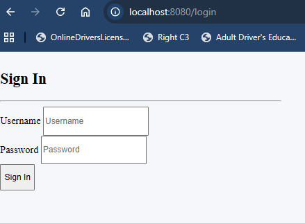

- This is a screenshot of the Orders Page after a successful login

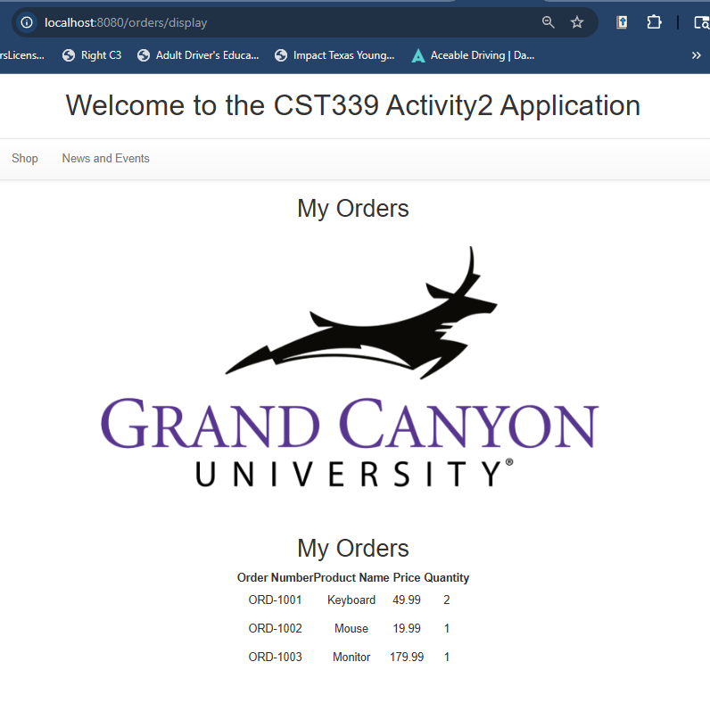

- This is a screenshot showing the logout message

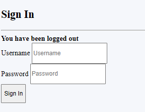

#### Part 2: Securing a Web Application Using a Database

- This is a screenshot of the Orders Page after logging in with credentials stored in MongoDB Atlas

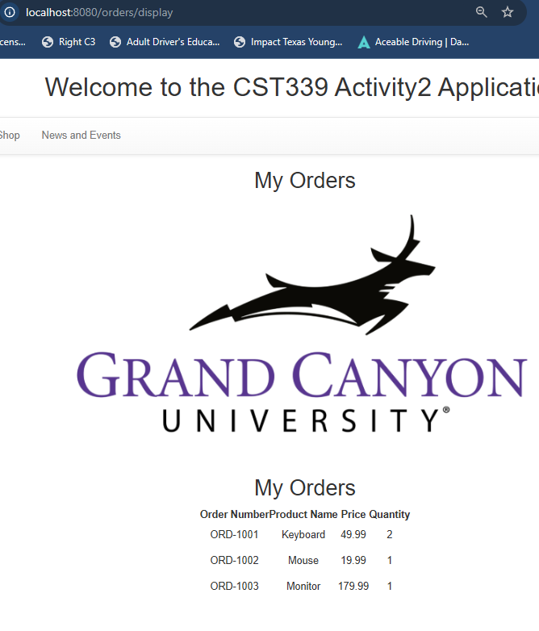

- This is a screenshot of the JSON response from the anonymous REST API

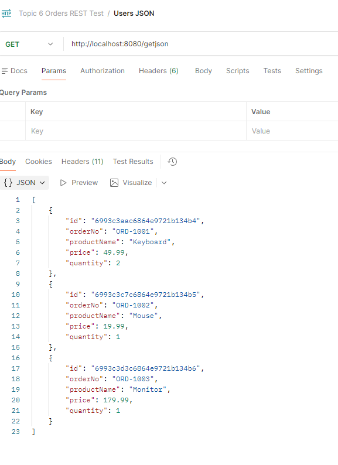

- This is a screenshot of the XML response from the anonymous REST API

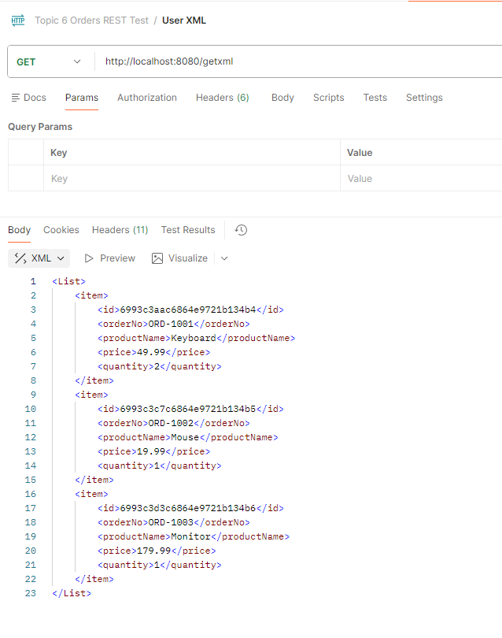

#### Part 3: Securing REST APIs Using Basic HTTP Authentication

- This is a screenshot of the JSON API tested in Postman using valid credentials

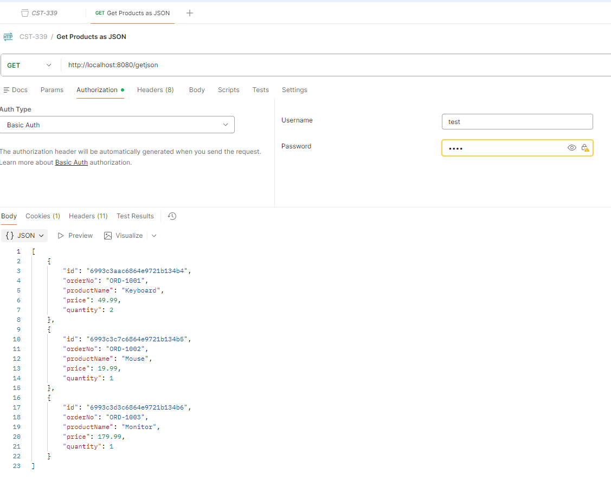

- This is a screenshot of the JSON API tested in Postman using invalid credentials

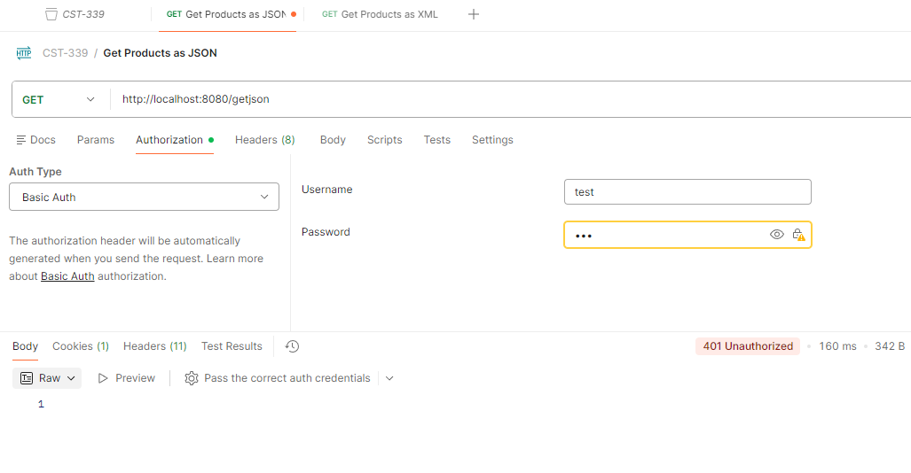

- This is a screenshot of the XML API tested in Postman using valid credentials

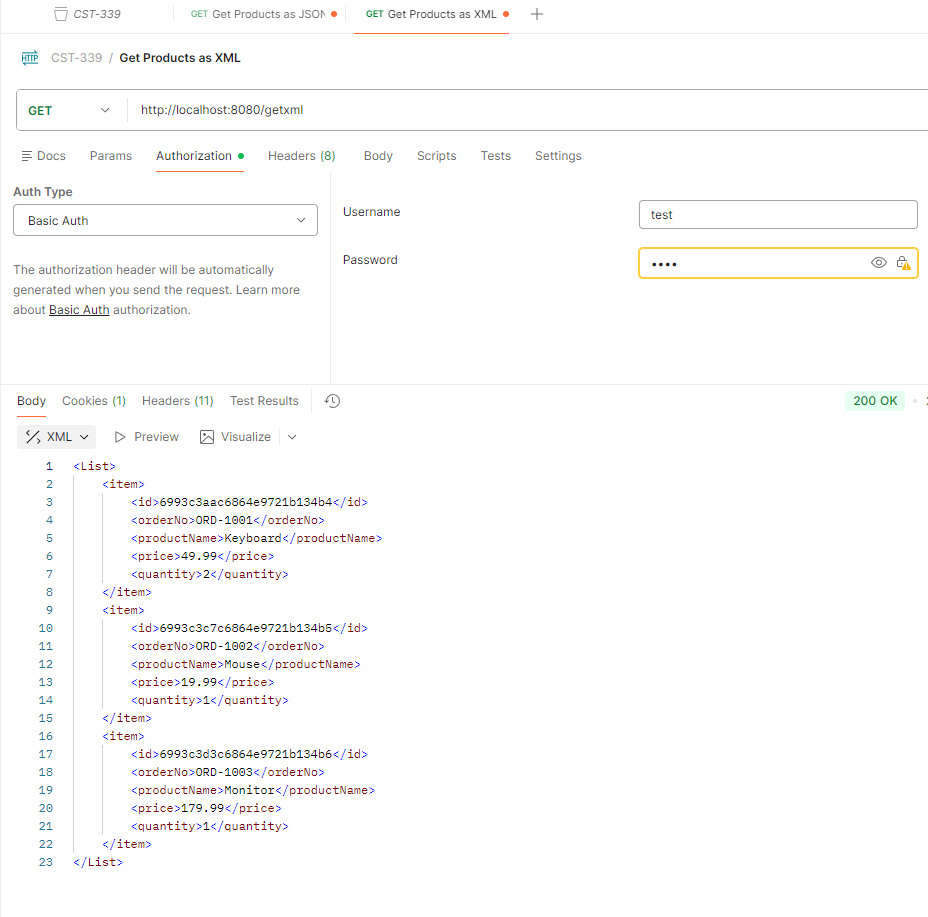

- This is a screenshot of the XML API tested in Postman using invalid credentials

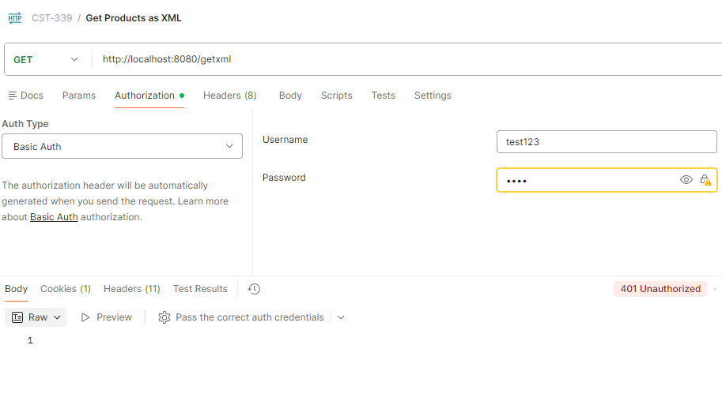

#### Part 4: Securing REST APIs Using OAuth2 Authentication

- This is a screenshot of the GitHub login screen

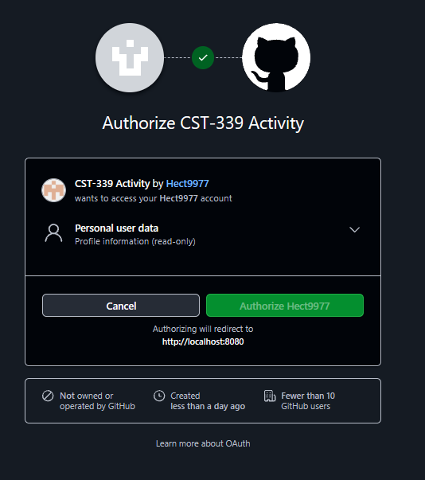

- This is a screenshot of the secured API response after authenticating with GitHub

## Research Questions

### Research the Forms Based authentication scheme. Describe how this works. Why it is important to use the Spring Security framework versus developing your own custom security framework?

Forms-based authentication is an effective method that immediately redirects unauthenticated users to a dedicated login page where they must enter their credentials. These credentials are then posted to the server for validation against a user database. When the credentials are verified, the server generates a session and issues a session cookie to the user's browser, enabling them to stay logged in for future requests.

It is absolutely imperative to use Spring Security rather than attempting to build a custom framework. Security is notoriously complex, and getting it right is crucial. Spring Security delivers robust, battle-tested protection against common vulnerabilities, including Cross-Site Request Forgery (CSRF), Session Hijacking, and SQL Injection, straight out of the box. By leveraging a well-established framework, you gain the advantage of years of community auditing and continuous updates, ensuring that your application remains secure without the significant risks associated with a homemade solution. Don’t leave your security to trust in a proven standard.

### Research the Basic HTTP authentication schema. Describe how this works. How does this technology help secure a REST API endpoint?

Basic HTTP authentication is an effective security method in which the client sends a username and password as a Base64-encoded string within the Authorization header of every request. When a client attempts to access a protected REST API endpoint, the server challenges the request. The client is required to provide the credentials in the format username:password, which the server decodes and validates against its user database.

In the realm of REST APIs, this method is a straightforward and efficient way to identify and authorize clients without the complexity of managing session state or cookies, perfectly aligning with the stateless nature of REST. However, it's essential to use this technology exclusively over HTTPS. This ensures that credentials remain encrypted during transmission, effectively safeguarding the endpoint from "man-in-the-middle" attacks.

## Conclusion

In Activity 6, we expanded our Spring Boot application by adding multiple layers of security using Spring Security. In Part 1, we secured the web application with in-memory authentication and enhanced the login page with user-friendly feedback for invalid credentials and logout events. In Part 2, we replaced the in-memory user store with MongoDB Atlas, allowing authentication against users stored in the database with encrypted passwords using BCrypt. In Part 3, we secured REST API endpoints using Basic HTTP Authentication and verified access in Postman with both valid and invalid credentials. Finally, in Part 4, we implemented OAuth2 authentication with GitHub to secure a REST endpoint using an external identity provider. Overall, this activity demonstrated how Spring Security can be used to protect both web applications and APIs through multiple authentication approaches, reinforcing key concepts in secure application design.
