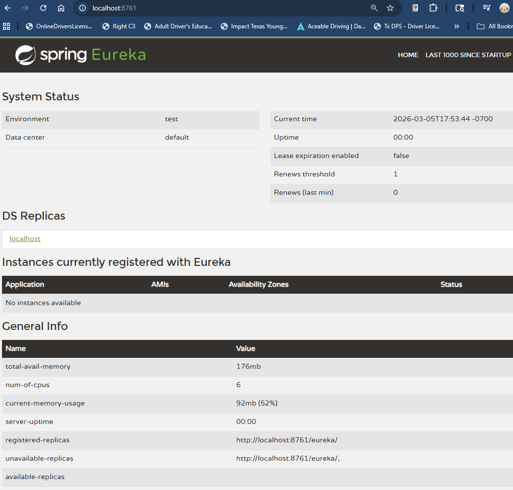
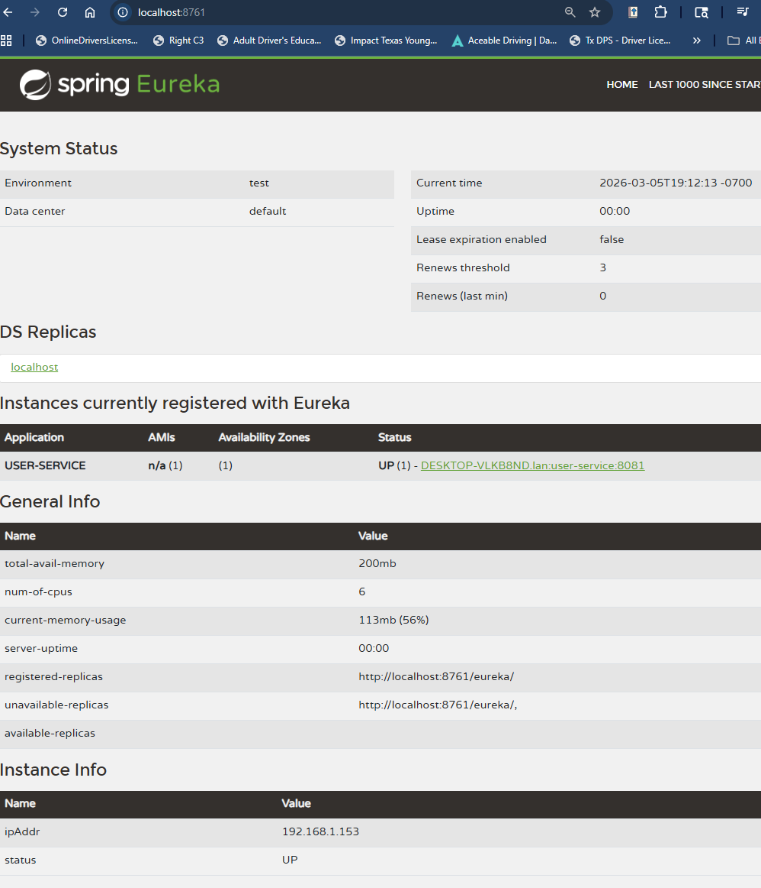
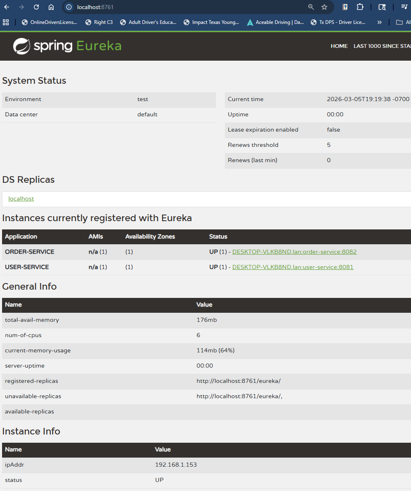
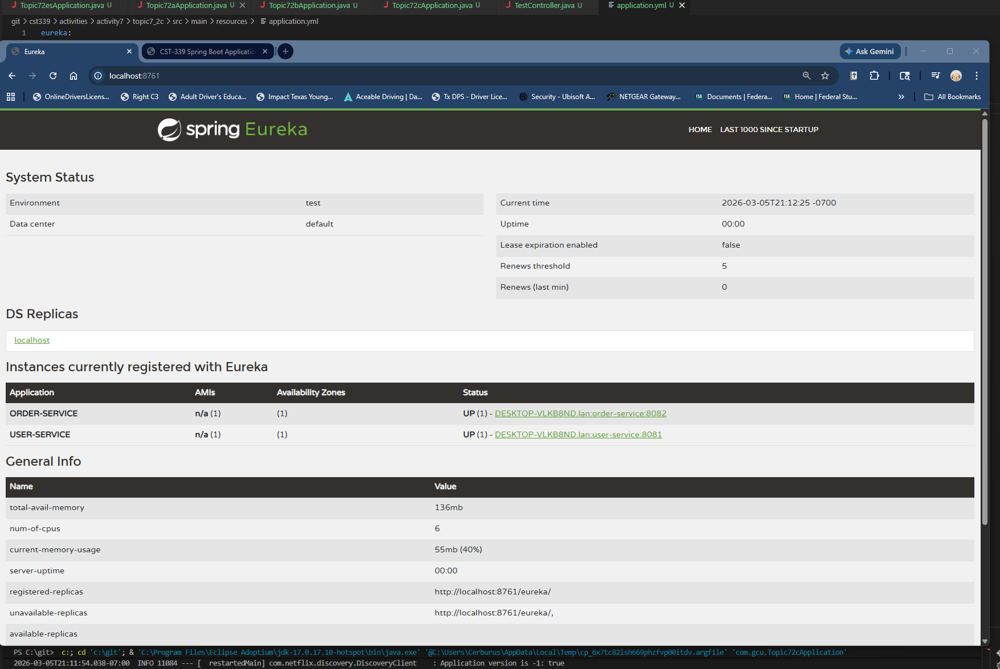
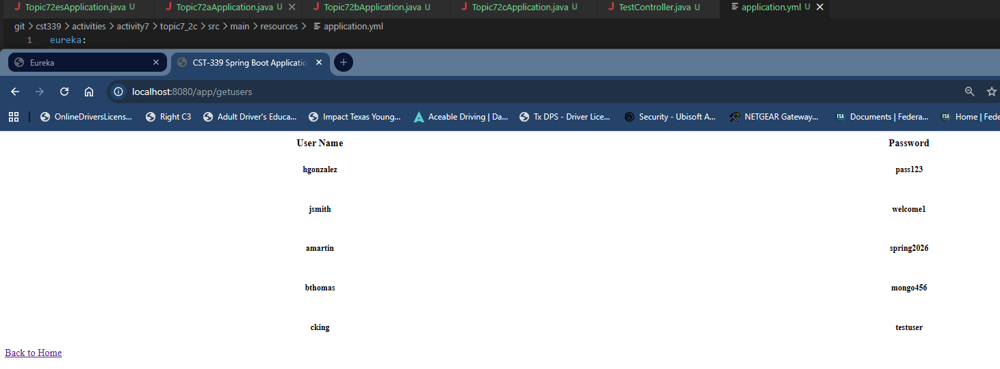
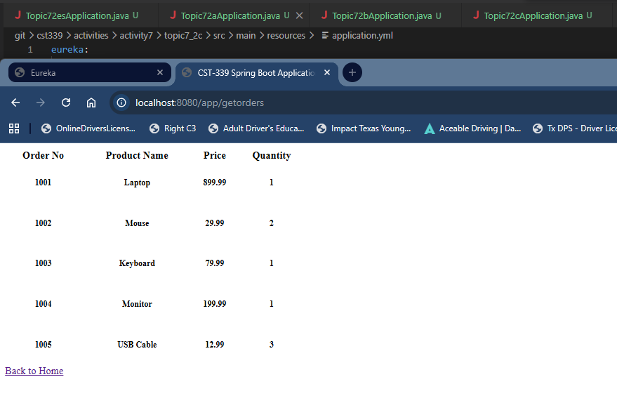

# CST339 - Activity 7 - Microservices

- This activity provided the following:
  - Describe microservices and how they differ from traditional monolithic architectures
  - Describe the challenges when moving from traditional monolithic architectures to a microservice architecture style
  - Examine the application of the Christian worldview within programming

---

## Screenshots

### Part 1: Building a Web Application That Consumes Microservices

- Browser screenshots of the Users API response.

- Browser screenshots of the Orders API response.

---

### Part 2: Integrating a REST Service Registry and Discovery Service

- Screenshot of the Eureka dashboard before any services were registered.

- Screenshot showing USER-SERVICE registered with Eureka.

- Screenshot showing ORDER-SERVICE registered with Eureka.

- Screenshots showing the web app successfully displaying Users and Orders while discovering endpoints through Eureka.

  
  

---

## Research Questions (Activity Guide)

### 1)Research microservices. Describe what they are. How does this architecture style differ from traditional monolithic architectures?

Microservices is a powerful architectural style that structures an application as a collection of small, independent services. These services communicate over a network, typically leveraging REST or messaging protocols, and focus on specific business capabilities. This approach stands in stark contrast to the traditional monolithic architecture, where the entire application, including the user interface, business logic, and database access, is built as a single, unified unit.

In a monolithic architecture, all components are tightly coupled, meaning that even a minor change in one area requires redeploying the entire system. Microservices, on the other hand, empower teams to develop, deploy, and scale each service independently. This architecture not only enhances flexibility but also allows the use of diverse technologies tailored to specific tasks. While microservices do introduce added complexity in terms of network communication, data consistency, and monitoring, they ultimately provide a more adaptable and resilient framework compared to the limitations of a single monolithic codebase.

### 2) Research microservices. What are 5 challenges you might encounter when modifying a monolithic architecture to this architecture style?

Transitioning from a monolith to a microservices architecture presents several significant operational and design challenges that can catch teams off guard:

- First, data consistency becomes problematic. Moving from a single shared database to distributed data stores complicates the maintenance of "ACID" transactions across services.

- Second, there is a substantial increase in operational complexity. This shift necessitates sophisticated CI/CD pipelines, container orchestration tools like Kubernetes, and robust monitoring solutions to manage the numerous moving parts effectively.

- Third, network latency and reliability emerge as critical issues. As internal function calls are replaced by remote API calls, the potential for failures or slowdowns can impact the entire system.

- Fourth, managing security becomes more challenging. Each new service and network entry point expands the "attack surface," requiring more attention to security measures.

- Finally, organizational overhead can increase. Teams must transition from working on a single large codebase to overseeing independent service lifecycles. This shift demands a high level of coordination and the adoption of a "DevOps" culture to achieve success.

---

## Conclusion

In this activity, I built two REST microservices (Users and Orders) backed by MongoDB and created a web application that consumed those microservices through REST calls. In Part 2, I extended the solution by adding a Eureka Server for service registration and discovery. With Eureka in place, the web application no longer needed hard-coded ports for the services and could discover service locations dynamically. Overall, this activity showed the benefits of microservices, demonstrated common challenges such as configuration and coordination, and reinforced the importance of building systems responsibly with maintainability and integrity in mind.
