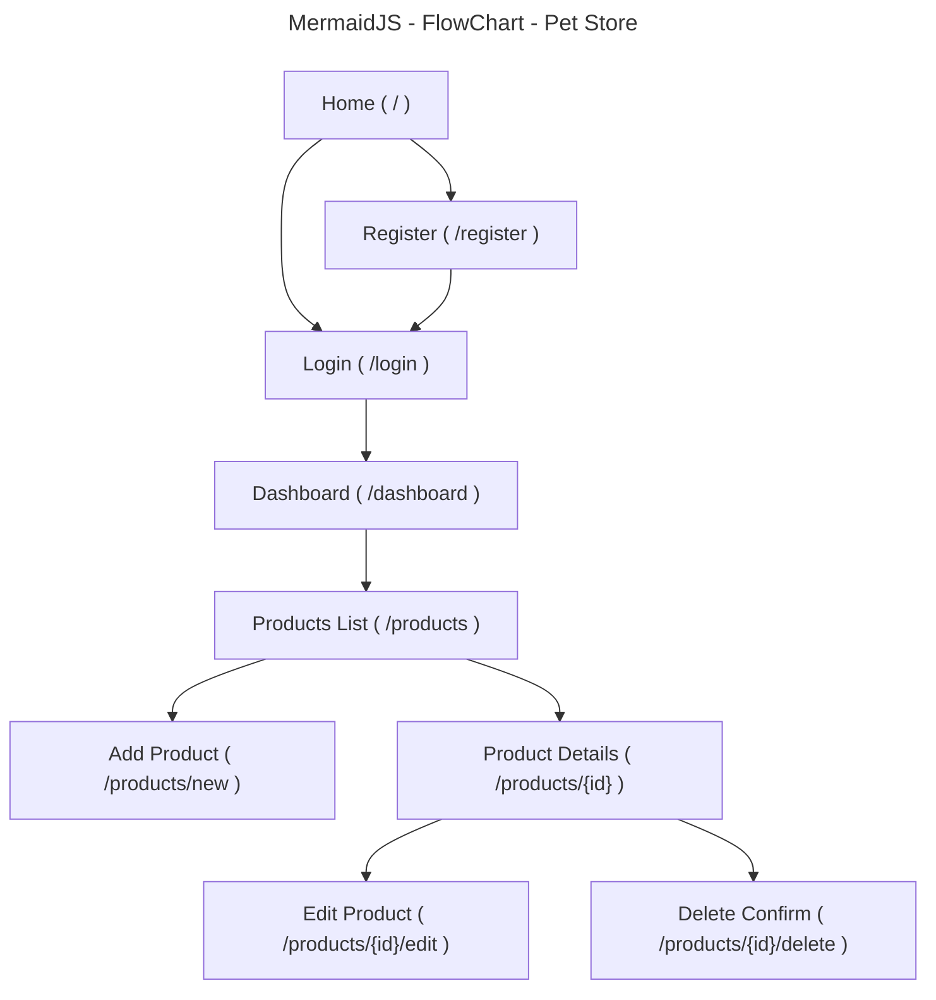

# Grand Canyon University (GCU) Programming in Java III CST-339 - Milestone 1

## Project Proposal, Sitemap and Division of Work

#### Project Status and Design Report

|User Story|Team Member|Hours Worked|Hours Remaining|
|--|--|--|--|
|Milestone 1 Proposal, Sitemap, Division of Work|Hector Gonzalez|12|70|

#### Planning Documentation

###### Initial Planning

The project will be managed using a simple Agile approach:

- We will use a task board (GitHub Projects) to track work.
- For each milestone, we will:
  - Write a short list of tasks that must be completed
  - Assign tasks to each teammate
  - Meet 1–2 times during the week to check progress and unblock issues
  - Demo what we finished at the end of the milestone (screencast or live demo if needed)

Communication and coordination:
- Main communication: (Discord / Microsoft Teams / Group Chat)
- File sharing: (GitHub repo + shared document for the report)
- Each person will push work to a feature branch and merge after review (when possible).

###### Retrospective Results

Post anything that went well or bad here (update weekly). Example:

**Went well**
- Clear agreement on project topic and scope
- Tasks were split evenly
- Sitemap and feature list matched the milestone requirements

**Needs improvement**
- (Example) Need quicker responses in group chat
- (Example) Need to define product fields earlier
- (Example) Need to meet at a consistent time

#### Design Documentation

###### General Technical Approach

This application will be built as an **N-Layer Spring Boot web app**:

- **UI Layer (Presentation):** Spring MVC and Bootstrap pages the user interacts with
- **Logic Layer (Business):** service classes that contain the rules and “what the app does”
- **Data Layer (Persistence):** database and data access code (added in later milestones)

The web pages will use **Bootstrap** so they look good on phones and computers.

###### Key Technical Design Decisions

**Domain Choice:** Pet store inventory and product catalog management.

**Main “Product” Entity:** Pet store items (food, toys, treats, grooming supplies, accessories).

**Initial Product Fields:**
- Name
- Category
- Price
- Quantity in stock
- Description

**Main Features Planned:**
- User registration and login
- Product CRUD (list, add, details, edit, delete)
- Form validation (example: price cannot be negative)
- Responsive UI (Bootstrap)
- Clear N-Layer separation (keep UI, logic, and data separate)

Planned later milestones:
- Add relational database (MySQL/PostgreSQL)
- Add Spring Security to protect pages
- Add secured REST endpoints for products

###### Risks

**Risk 1: Spring Security may be confusing.**  
Mitigation: Add security step-by-step and test on a small number of pages first.

**Risk 2: Switching to a database later could break earlier code.**  
Mitigation: Keep data access code in its own layer so it is easier to change.

**Risk 3: Doing too much extra work (scope creep).**  
Mitigation: Only build what the milestone requires first. Save extra ideas for later.

**Risk 4: Team coordination issues (missed meetings, uneven workload).**  
Mitigation: Use the task board, short weekly check-ins, and clear task assignments.

###### Division of Work (3-Person Team Approach)

- **Person A (Backend / Logic)**
  - Build Spring Boot controllers and service classes
  - Make sure the “rules” of the app are correct (business logic)

- **Person B (Frontend / Pages)**
  - Build Thymeleaf pages and navigation
  - Use Bootstrap for layout and responsive design
  - Display validation messages on forms

- **Person C (Database + Security)**
  - Plan the database structure and help connect the database in later milestones
  - Help implement Spring Security login protection later
  - Help with REST API setup later milestones

###### Division of Work (Solo Approach)

If one person is doing the project, the work will be simplified like this:

- **Step 1: Build the backend first**
  - Create basic controllers and services for products and users

- **Step 2: Build the pages**
  - Create Thymeleaf pages for login/register and product CRUD
  - Add Bootstrap for a clean layout

- **Step 3: Test and validate**
  - Add form validation (required fields, price >= 0, quantity >= 0)
  - Make sure navigation works

- **Step 4 (Later milestones): Add database + security**
  - Connect to MySQL/PostgreSQL
  - Add Spring Security one page at a time
  - Add REST endpoints when required

## Sitemap Diagram

Below is the initial sitemap and how pages connect.

### Public Pages (No Login Needed)
- `/` — Home
- `/register` — Register account
- `/login` — Login

### After Login (Secured Later)
- `/dashboard` — Main landing page after login
- `/products` — Product list (table)

### Product Pages (Linked from Product List)
- `/products/new` — Add product
- `/products/{id}` — Product details
- `/products/{id}/edit` — Edit product
- `/products/{id}/delete` — Delete confirmation

### Mermaid Sitemap:

**How the pages interact:**
- Home → Register → Login → Dashboard
- Dashboard → Products List
- Products List → (Add / View / Edit / Delete)

## User Interface Diagram (if applicable)

Optional notes (can be replaced with a picture/wireframe later):

- Top navigation (after login): Dashboard | Products | Logout
- Product list page: table of products + buttons (View/Edit/Delete) + “Add Product”
- Add/Edit product page: form fields + validation messages

## Class Diagram (if applicable)

Not required for Milestone 1, but planned classes include:

- `Product` (model)
- `User` (model)
- `ProductController` (UI/controller layer)
- `ProductService` (business layer)
- `ProductRepository` or `ProductDAO` (data layer, later milestone)

## Service API Design (if applicable)

Not required for Milestone 1. Planned later milestones:

- `GET /api/products` — return all products
- `GET /api/products/{id}` — return one product by id

## Security Design (if applicable)

Not required for Milestone 1. Planned later milestones:

- Use Spring Security for form login
- Require login for all pages except home/register/login
- Secure REST endpoints (no anonymous access)

## Miscellaneous

- Project will be submitted for instructor approval before moving forward.
- Team will keep scope focused on milestone requirements first.
