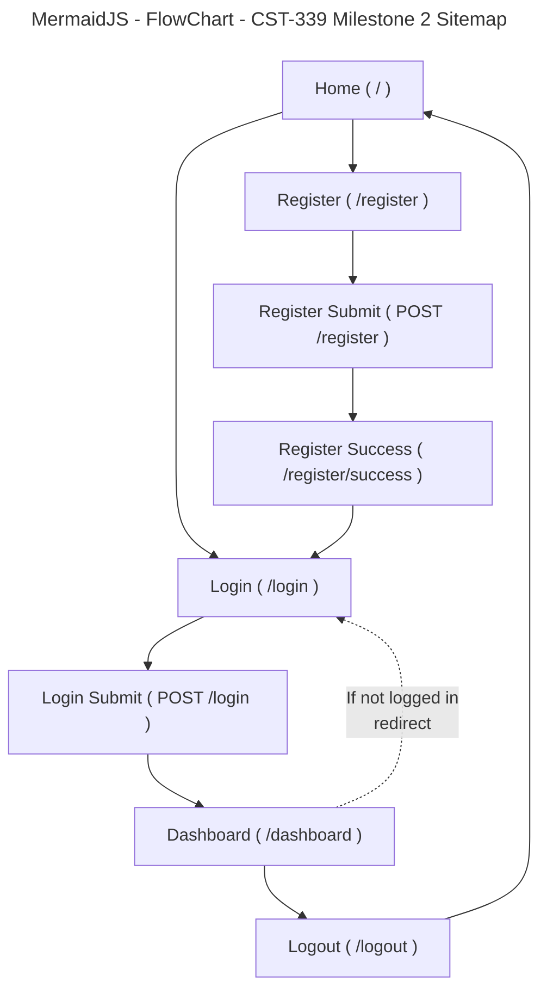

# Grand Canyon University (GCU) Programming in Java III CST-339 - Milestone 2

## Project Proposal, Sitemap and Division of Work

#### Project Status and Design Report

|User Story|Team Member|Hours Worked|Hours Remaining|
|--|--|--|--|
|Milestone 2: Main App Shell (Home + Navigation) | Solo | 4 | 0 |
|Milestone 2: Registration Module (No Database) | Solo | 5 | 0 |
|Milestone 2: Login Module (No Database) | Solo | 5 | 0 |
|Milestone 2: Responsive UI using Bootstrap | Solo | 3 | 0 |
|Milestone 2: Thymeleaf Layouts (Fragments: head/nav/footer) | Solo | 3 | 0 |
|Milestone 2: Debugging + Fixes (Validation + Thymeleaf errors) | Solo | 2 | 0 |

---

#### Planning Documentation

###### Initial Planning

The project will be implemented as a simple Spring Boot N-layer web application using Spring MVC and Thymeleaf. For Milestone 2, the focus is on building the basic site shell and the authentication pages (registration and login) **without using a database**. The application will use:
- Spring MVC controllers to handle routes (Home, Register, Login, Dashboard).
- Thymeleaf templates for server-side rendered pages.
- Bootstrap CDN for a responsive layout and consistent styling.
- Thymeleaf fragments (header/nav/footer) to avoid repeating layout code.

A lightweight in-memory service will temporarily store registered users (email/password) to simulate authentication until Milestone 3+ introduces a database layer.

###### Retrospective Results

**What went well**
- The homepage and navigation were created quickly using Bootstrap.
- Thymeleaf fragments made it easy to reuse the same header/nav/footer across all pages.
- Registration and login flows worked correctly using an in-memory service (no DB required for Milestone 2).

**What was challenging**
- Validation annotations initially caused compilation errors because the validation dependency was missing.
- Thymeleaf threw a runtime error on the login page because global form errors were rendered outside the `<form>` binding context.

**How we fixed issues**
- Added the proper Spring Boot starter for validation so `@Valid` and constraint annotations worked.
- Moved the global errors block inside the `<form th:object="...">` so Thymeleaf could bind form errors correctly.

---

## Design Documentation

###### General Technical Approach

This Milestone 2 application uses a layered approach:

- **Presentation Layer (View):**
  - Thymeleaf templates render pages such as Home, Register, Login, and Dashboard.
  - Bootstrap is used for responsive UI components (navbar, spacing, form styling).

- **Controller Layer (Web Layer):**
  - Spring MVC controllers handle HTTP GET/POST routes.
  - Controllers manage form submission, validation, and redirects.

- **Service Layer (Business Logic):**
  - An in-memory authentication service stores users in a map keyed by email.
  - This simulates registration and login functionality without a database (per Milestone 2 requirements).

No persistence layer is included yet because Milestone 2 explicitly does not require a database. (Yet....)

###### Key Technical Design Decisions

1. **Use Spring Boot 4 + Spring MVC**
   - Provides a clean structure for controllers, routing, and server execution.

2. **Use Thymeleaf + Fragments**
   - Thymeleaf templates support server-rendered views.
   - Fragments (`head.html`, `navbar.html`, `footer.html`) reduce duplicated HTML and keep the UI consistent.

3. **Use Bootstrap via CDN**
   - Ensures responsive design with minimal configuration.
   - Simple to use and meets the milestone requirement for a responsive UI.

4. **Use In-Memory Authentication (No DB)**
   - Implemented a simple map-based service to store users.
   - Allows realistic registration/login flows without introducing database complexity in Milestone 2.

5. **Use Bean Validation**
   - Applied `@NotBlank`, `@Email`, and `@Size` to enforce input correctness.
   - Used `@Valid` and `BindingResult` to show validation feedback on the form page.

###### Risks

- **No real security yet**
  - Passwords are stored in plain text temporarily (acceptable for Milestone 2, but must be improved later).
- **In-memory storage resets on restart**
  - Registered users disappear when the application restarts.
- **Session handling is basic**
  - Dashboard access uses a simple session attribute check and redirects to login if not logged in.
- **Future database integration**
  - The in-memory service will need to be replaced with a repository/DAO layer in later milestones.

###### Division of Work (Solo Approach)

Since this was completed as a solo project, work was divided by feature modules:

- UI + Layout: fragments and Bootstrap navbar/footer
- Controllers: HomeController, AuthController, DashboardController
- Models: LoginForm, RegisterForm, User
- Service: InMemoryAuthService
- Testing/Debugging: validation dependency + Thymeleaf binding fixes

---

### Mermaid Site Map

## How the Pages Interact (Milestone 2)

Home → Register → Register Success  
Home → Login → Dashboard  
Dashboard → Logout → Home  

**Technical Notes**
- `GET /register` displays the registration form.
- `POST /register` validates input and stores the user in-memory (no database for Milestone 2).
- `GET /register/success` confirms registration.
- `GET /login` displays the login form.
- `POST /login` validates credentials against the in-memory user store and sets session attributes.
- `GET /dashboard` checks session; if not logged in, it redirects to `/login`.
- `GET /logout` clears the session and redirects to `/`.

---

## User Interface Diagram (Milestone 2)

Optional notes (can be replaced with a picture/wireframe later):

- **Top navigation (always visible):** Home | Register | Login | Dashboard | Logout  
- **Home page:** simple welcome text + buttons/links to Register/Login/Dashboard  
- **Register page:** form fields + validation messages  
- **Login page:** form fields + validation messages + global error message on failed login  
- **Dashboard page:** displays session-based user info (name/email) and provides Logout link

---

## Class Diagram (Milestone 2)

Planned/implemented classes for Milestone 2 include:

- **RegisterForm** (model) — validation annotations for registration fields  
- **LoginForm** (model) — validation annotations for login fields  
- **User** (model) — stores basic user info for in-memory authentication  
- **InMemoryAuthService** (service layer) — handles register/login logic without a database  
- **HomeController** (controller layer) — serves `/`  
- **AuthController** (controller layer) — serves `/register`, `/login`, `/logout`  
- **DashboardController** (controller layer) — serves `/dashboard` with session check  

---

## Service API Design (Milestone 2)

Not applicable for Milestone 2.  
Milestone 2 uses **Spring MVC server-rendered pages** (Thymeleaf) rather than REST endpoints.

---

## Security Design (Milestone 2)

Milestone 2 security is intentionally simplified:

- Authentication is simulated using an **in-memory user store**.
- Dashboard is protected by a **session attribute check** (redirect to `/login` if not logged in).
- Logout clears the session.

Future milestones can introduce Spring Security and database-backed authentication.

---

## Miscellaneous

- Scope is intentionally kept small to match Milestone 2 requirements:
  Spring MVC pages + Bootstrap + Thymeleaf fragments + registration/login without DB.
- Known limitation: users reset when the app restarts because storage is in-memory.

## Screencast URL 

- [My Presentation](https://www.loom.com/share/0f3b3d2698d741519c27f4d501c1e742)
