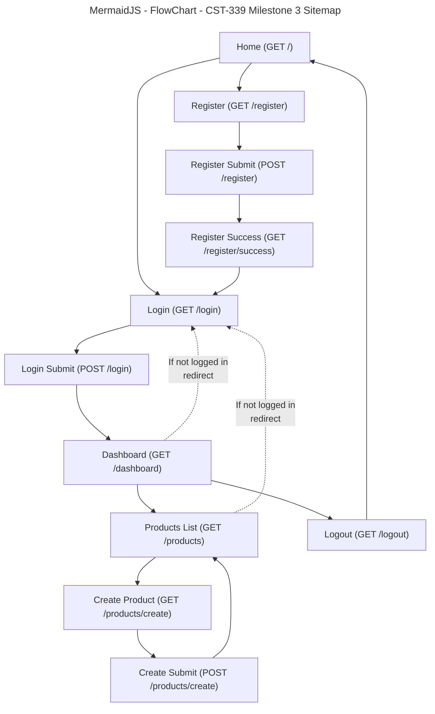

# Grand Canyon University (GCU) Programming in Java III CST-339 - Milestone 3

## Project Proposal, Sitemap and Division of Work

### Project Status and Design Report

|User Story|Team Member|Hours Worked|Hours Remaining|
|--|--|--:|--:|
|Milestone 2: Main App Shell (Home + Navigation) | Solo | 4 | 0 |
|Milestone 2: Registration Module (No Database) | Solo | 5 | 0 |
|Milestone 2: Login Module (No Database) | Solo | 5 | 0 |
|Milestone 2: Responsive UI using Bootstrap | Solo | 3 | 0 |
|Milestone 2: Thymeleaf Layouts (Fragments: head/nav/footer) | Solo | 3 | 0 |
|Milestone 2: Debugging + Fixes (Validation + Thymeleaf form errors) | Solo | 2 | 0 |
|Milestone 3: Product Creation Module (Spring MVC, No Database) | Solo | 5 | 0 |
|Milestone 3: Product List Page (to verify create works) | Solo | 2 | 0 |
|Milestone 3: Refactor Auth to Spring Beans + IoC (Service Interfaces + Injection) | Solo | 3 | 0 |
|Milestone 3: Updated Design Report + Diagrams | Solo | 2 | 0 |

---

## Planning Documentation

### Initial Planning

The project will be implemented as a simple Spring Boot N-layer web application using Spring MVC and Thymeleaf.  
For **Milestone 3**, the focus is on adding the **Product Creation module** while refactoring the authentication components to follow **Spring Core / IoC** best practices — all **without using a database**.

The application uses:
- Spring MVC controllers to handle routes (Home, Register, Login, Dashboard, Products).
- Thymeleaf templates for server-side rendered pages.
- Bootstrap CDN for responsive layout and form styling.
- Thymeleaf fragments (head/navbar/footer) for consistent shared UI.
- In-memory services for users and products (temporary until later milestones introduce persistence).

### Retrospective Results

**What went well**
- Milestone 2 pages stayed stable while new Milestone 3 features were added.
- Product creation was straightforward using Spring MVC forms + validation.
- Refactoring Auth into interfaces and service beans made the design cleaner and more “enterprise”.

**What was challenging**
- IoC refactoring required separating controller responsibilities from service responsibilities.
- Form validation and Thymeleaf error rendering needed proper binding context inside the `<form th:object="...">`.

**How we fixed issues**
- Ensured form errors are shown inside the `<form>` so Thymeleaf can bind errors correctly.
- Created service interfaces (AuthService/ProductService) and used constructor injection to demonstrate IoC clearly.

---

## Design Documentation

### General Technical Approach

This Milestone 3 application uses a layered approach:

- **Presentation Layer (View):**
  - Thymeleaf templates render pages such as Home, Register, Login, Dashboard, Products List, and Create Product.
  - Bootstrap is used for responsive UI components (navbar, spacing, form layout, table formatting).

- **Controller Layer (Web Layer):**
  - Spring MVC controllers handle HTTP GET/POST routes.
  - Controllers manage page navigation, validation, session checks, and redirects.

- **Service Layer (Business Logic / Spring Core):**
  - `AuthService` and `ProductService` are Spring-managed beans.
  - Implementations use in-memory data structures (maps/lists) because Milestone 3 does not use a database.

No persistence layer is included yet because Milestone 3 explicitly requires **no database**.

### Key Technical Design Decisions

1. **Use Spring Boot 4 + Spring MVC**
   - Keeps routing and view handling simple and consistent.

2. **Use Thymeleaf + Fragments**
   - Shared fragments (head/navbar/footer) keep pages consistent and reduce duplication.

3. **Use Bootstrap via CDN**
   - Provides responsive UI with minimal configuration.

4. **Use IoC / Spring Beans for Services**
   - Refactored authentication and product logic into service beans.
   - Controllers use constructor injection to follow IoC and keep controllers thin.

5. **Use Bean Validation**
   - Applied validation annotations to Auth and Product forms.
   - Used `@Valid` and `BindingResult` to display validation errors on the same page.

### Risks

- **No real security framework yet**
  - Authentication uses sessions and simple checks instead of Spring Security (planned later).
- **In-memory storage resets on restart**
  - Users and products disappear after application restarts (expected for Milestone 3).
- **Basic session-based access**
  - Dashboard and product pages may require session checks; risk of exposing pages if not guarded.
- **Future database integration**
  - In-memory services must be replaced with repository/DAO layer later.

### Division of Work (Solo Approach)

Work was split by feature modules:

- UI + Layout: fragments and Bootstrap styling
- Controllers: HomeController, AuthController, DashboardController, ProductController
- Models: LoginForm, RegisterForm, ProductForm, User, Product
- Services: AuthService/InMemoryAuthService, ProductService/InMemoryProductService
- Testing/Debugging: validation fixes, Thymeleaf form binding, redirects/navigation

---

## Sitemap Diagram (Milestone 3)

### Mermaid Site Map

## How the Pages Interact (Milestone 3)

Home → Register → Register Success  
Home → Login → Dashboard  
Dashboard → Products List → Create Product → Products List  
Dashboard → Logout → Home  

### Technical Notes

- `GET /products` shows the current in-memory product list.
- `GET /products/create` shows the create product form.
- `POST /products/create` validates input and saves the product into an in-memory list, then redirects back to `/products`.

---

## User Interface Diagram (Milestone 3)

Optional notes (can be replaced with a picture/wireframe later):

- **Top navigation:** Home | Register | Login | Dashboard | Products | Logout
- **Home page:** welcome + navigation links
- **Register page:** form fields + validation messages
- **Login page:** form fields + validation messages + global error on failed login
- **Dashboard page:** shows session-based user info (name/email)
- **Products list page:** table of products + “Add Product” button
- **Create product page:** product form fields + validation messages

---

## Class Diagram (Milestone 3)

Planned/implemented classes include:

### Models
- `User`
- `RegisterForm`
- `LoginForm`
- `Product`
- `ProductForm`

### Controllers
- `HomeController`
- `AuthController`
- `DashboardController`
- `ProductController`

### Service Layer (IoC / Spring Beans)
- `AuthService` (interface)
- `InMemoryAuthService` (implementation / `@Service`)
- `ProductService` (interface)
- `InMemoryProductService` (implementation / `@Service`)

---

## Service API Design (Milestone 3)

Not applicable for Milestone 3.  
Milestone 3 uses **Spring MVC server-rendered pages (Thymeleaf)** rather than REST endpoints.

---

## Security Design (Milestone 3)

Milestone 3 security is intentionally simplified:

- Authentication is simulated using an **in-memory user store**.
- Access to Dashboard (and optionally Products) is enforced using **session attribute checks**.
- Logout clears the session.

Future milestones can introduce:

- Spring Security for form login
- Role-based access control
- Securing endpoints using configuration instead of manual session checks

---

## Miscellaneous

- Scope is intentionally kept small to match Milestone 3 requirements:  
  Product creation + IoC refactor + no database.
- Known limitation: users and products reset when the app restarts because storage is in-memory.
- Thymeleaf fragment syntax should use the newer style: `~{fragments/file :: fragmentName}` to avoid warnings.

---

## Screencast URL

- [My Presentation]()

### Presentation Summary

In the screencast, I demonstrate running the Spring Boot application locally and navigating through the Milestone 3 features. I start at the Home page, show the shared Bootstrap navigation, and demonstrate registration and login using the refactored service beans (IoC). After logging in, I access the Dashboard and then navigate to the Products module. I show the Products list page and create a new product using the Create Product form with validation. After submitting the product, the application redirects back to the Products list where the new product appears, proving that product creation works without a database.
