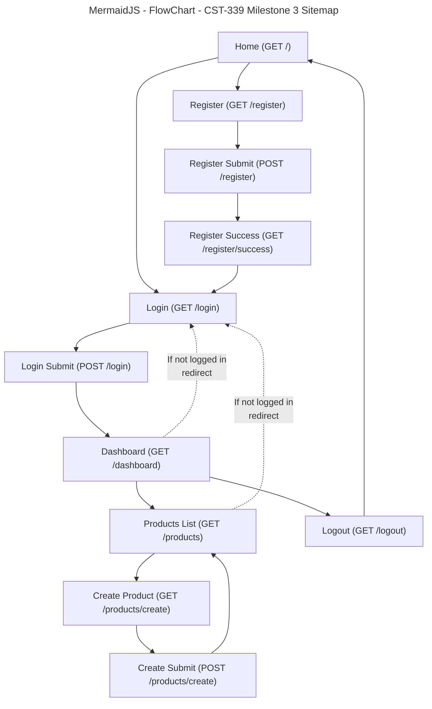

# Grand Canyon University (GCU) Programming in Java III CST-339 - Milestone 4

## Project Proposal, Sitemap and Division of Work

### Project Status and Design Report

| User Story                                                                                | Team Member | Hours Worked | Hours Remaining |
| ----------------------------------------------------------------------------------------- | ----------- | -----------: | --------------: |
| Milestone 2: Main App Shell (Home + Navigation)                                           | Solo        |            4 |               0 |
| Milestone 2: Registration Module (No Database)                                            | Solo        |            5 |               0 |
| Milestone 2: Login Module (No Database)                                                   | Solo        |            5 |               0 |
| Milestone 2: Responsive UI using Bootstrap                                                | Solo        |            3 |               0 |
| Milestone 2: Thymeleaf Layouts (Fragments: head/nav/footer)                               | Solo        |            3 |               0 |
| Milestone 2: Debugging + Fixes (Validation + Thymeleaf form errors)                       | Solo        |            2 |               0 |
| Milestone 3: Product Creation Module (Spring MVC, No Database)                            | Solo        |            5 |               0 |
| Milestone 3: Product List Page (to verify create works)                                   | Solo        |            2 |               0 |
| Milestone 3: Refactor Auth to Spring Beans + IoC (Service Interfaces + Injection)         | Solo        |            3 |               0 |
| Milestone 3: Updated Design Report + Diagrams                                             | Solo        |            2 |               0 |
| Milestone 4: MySQL Database Setup + Schema (USERS, PRODUCTS)                              | Solo        |            3 |               0 |
| Milestone 4: Configure Spring Boot DataSource (Hikari) + JDBC Driver                      | Solo        |            2 |               0 |
| Milestone 4: Spring Data JDBC Repositories (UserRepository, ProductRepository)            | Solo        |            3 |               0 |
| Milestone 4: Persist Registration/Login to Database (AuthServiceImpl + UserEntity)        | Solo        |            4 |               0 |
| Milestone 4: Persist Products to Database (ProductServiceImpl + ProductEntity)            | Solo        |            4 |               0 |
| Milestone 4: Fix Routing + Thymeleaf Template Paths (dashboard/products views)            | Solo        |            2 |               0 |
| Milestone 4: Debugging + Fixes (DB name/table errors, template errors, driver class typo) | Solo        |            3 |               0 |
| Milestone 4: Updated Design Report + Diagrams                                             | Solo        |            2 |               0 |

---

## Planning Documentation

### Initial Planning

For **Milestone 4**, the project evolves from in-memory storage into a database-backed Spring Boot N-layer web application.

The application uses:

- Spring MVC controllers to handle routes (Home, Register, Login, Dashboard, Products).
- Thymeleaf templates for server-side rendered pages.
- Bootstrap CDN for responsive layout and consistent UI.
- Thymeleaf fragments (head/navbar/footer) for shared layouts.
- **MySQL database** for persistent storage.
- **Spring Data JDBC repositories** to interact with MySQL for Users and Products.

### Retrospective Results

**What went well**

- Switching from in-memory lists to Spring Data JDBC repositories made persistence straightforward.
- Once the templates were placed in the correct location/names, navigation became stable again.
- Database-backed products creation and listing match the Milestone requirements well.

**What was challenging**

- Database mismatch issues (application pointing to a different schema than the one where tables were created).
- Template resolver errors (Whitelabel 500) when the controller returned a view name that did not exist.
- DataSource failures when the driver class name was incorrect (typo such as `com.mysql.cj.jdbc.Drive` instead of `Driver`) or the MySQL connector dependency was missing.

**How we fixed issues**

- Verified the configured DB name in `application.properties` matched the schema where tables exist.
- Ensured templates exist under `src/main/resources/templates/` and match the returned view names.
- Confirmed the MySQL connector dependency is present and the driver class is correct.

---

## Design Documentation

### General Technical Approach

This Milestone 4 application uses a layered approach:

- **Presentation Layer (View):**
  - Thymeleaf templates render pages such as Home, Register, Login, Dashboard, Products List, and Create Product.
  - Bootstrap is used for responsive UI components (navbar, spacing, form layout, table formatting).

- **Controller Layer (Web Layer):**
  - Spring MVC controllers handle HTTP GET/POST routes.
  - Controllers manage page navigation, validation, session checks, and redirects.

- **Service Layer (Business Logic / Spring Core):**
  - `AuthService` and `ProductService` are Spring-managed beans.
  - Implementations now call repository methods instead of using in-memory collections.

- **Persistence Layer (Database / Repository):**
  - MySQL stores persistent Users and Products.
  - Spring Data JDBC repositories handle SQL operations (find by email, find all, save, etc.).

### Key Technical Design Decisions

1. **Use Spring Boot 4 + Spring MVC**
   - Keeps routing and view handling simple and consistent.

2. **Use Thymeleaf + Fragments**
   - Shared fragments (head/navbar/footer) keep pages consistent and reduce duplication.
   - Updated fragment syntax recommended: `~{fragments/head :: head('Title')}` to avoid warnings.

3. **Use Bootstrap via CDN**
   - Provides responsive UI with minimal configuration.

4. **Use Spring Data JDBC**
   - Repositories replace in-memory storage.
   - Enables persistence without adding the complexity of JPA/Hibernate mappings.

5. **Use MySQL Schema and Tables**
   - Users and products stored in MySQL for persistence across application restarts.
   - Schema created using SQL scripts (database + USERS + PRODUCTS tables).

6. **Use Bean Validation**
   - Validation annotations on form models (RegisterForm, LoginForm, ProductForm).
   - `@Valid` and `BindingResult` used to display errors on the same page.

### Database Design (Milestone 4)

**Schema**

- A single schema/database (example: `milestoneDB`)

**Tables**

- `USERS`
  - `ID` (PK, auto increment)
  - `EMAIL` (unique)
  - `PASSWORD`
  - `FIRST_NAME`
  - `LAST_NAME`

- `PRODUCTS`
  - `ID` (PK, auto increment)
  - `NAME`
  - `DESCRIPTION`
  - `PRICE`
  - `QUANTITY`

> Important note: the application must connect to the same database where these tables were created.
> For example, if tables were created in `milestoneDB` but Spring is connecting to `cst339`, you will see errors like “Table 'cst339.users' doesn't exist”.

### Risks

- **No real security framework yet**
  - Authentication uses sessions and simple checks instead of Spring Security.
- **Password storage**
  - If passwords are stored as plain text, this is a security risk. (Hashing is recommended even if not required.)
- **Database configuration errors**
  - Wrong DB name, missing tables, or missing/incorrect JDBC driver can prevent the app from starting.
- **Template mismatch**
  - If controller returns `products` but the file is `Products.html` (case/name mismatch), Thymeleaf cannot resolve it.

### Division of Work (Solo Approach)

Work was split by feature modules:

- UI + Layout: fragments and Bootstrap styling
- Controllers: HomeController, AuthController, DashboardController, ProductController
- Models: LoginForm, RegisterForm, ProductForm
- Entities: UserEntity, ProductEntity
- Repositories: UserRepository, ProductRepository (Spring Data JDBC)
- Services: AuthService/AuthServiceImpl, ProductService/ProductServiceImpl
- Testing/Debugging: DB connection, schema alignment, template names, routing and redirects

---

## Sitemap Diagram (Milestone 4)

### Mermaid Site Map

## How the Pages Interact (Milestone 4)

Home → Register → Register Success  
Home → Login → Dashboard  
Dashboard → Products List → Create Product → Products List  
Dashboard → Logout → Home

---

## Technical Notes (Milestone 4)

- **GET /products**  
  Loads products from the database and displays them in a table.

- **GET /products/create**  
  Displays the product creation form.

- **POST /products/create**  
  Validates input and inserts the product into MySQL, then redirects to `/products`.

---

## User Interface Diagram (Milestone 4)

- **Top navigation:**  
  Home | Register | Login | Dashboard | Products | Logout

- **Home page:**  
  Welcome message with navigation links.

- **Register page:**  
  Registration form fields with validation messages.

- **Login page:**  
  Login form fields with validation messages and a global error on failed login.

- **Dashboard page:**  
  Displays session-based user information (name and email).

- **Products list page:**  
  Table of products loaded from the database with an **“Add Product”** button.

- **Create product page:**  
  Product form fields with validation messages.

---

## Class Diagram (Milestone 4)

### Models (Forms)

- `RegisterForm`
- `LoginForm`
- `ProductForm`

### Controllers

- `HomeController`
- `AuthController`
- `DashboardController`
- `ProductController`

### Service Layer (IoC / Spring Beans)

- `AuthService` (interface)
- `AuthServiceImpl` (implementation / `@Service`)
- `ProductService` (interface)
- `ProductServiceImpl` (implementation / `@Service`)

### Persistence Layer (Spring Data JDBC)

- `UserEntity`
- `ProductEntity`
- `UserRepository`
- `ProductRepository`

---

## Service API Design (Milestone 4)

Not applicable for Milestone 4.

Milestone 4 uses **Spring MVC server-rendered pages (Thymeleaf)** rather than REST endpoints.

---

## Security Design (Milestone 4)

Milestone 4 security is intentionally simplified:

- Authentication uses a **USERS** database table with session attributes.
- Access to Dashboard and Products pages is enforced using session attribute checks.
- Logout invalidates the session.

### Future Enhancements

- Spring Security form login
- Password hashing and stronger validation rules
- Role-based access control
- Securing endpoints using configuration instead of manual session checks

---

## Miscellaneous Notes

- Users and products now persist because storage is handled by **MySQL**.
- Thymeleaf view names must match template file names exactly:
  - If a controller returns `"products"`, the template must be `templates/products.html`
  - If a controller returns `"dashboard/index"`, the template must be `templates/dashboard/index.html`
- Ensure the JDBC driver class name is correct:  
  `com.mysql.cj.jdbc.Driver`
- Ensure the database schema name matches the value in `spring.datasource.url`.

---

## Screencast URL

- [My Presentation](https://www.loom.com/share/f9899354520d45dfa12d69c6c2a24f43)

---
