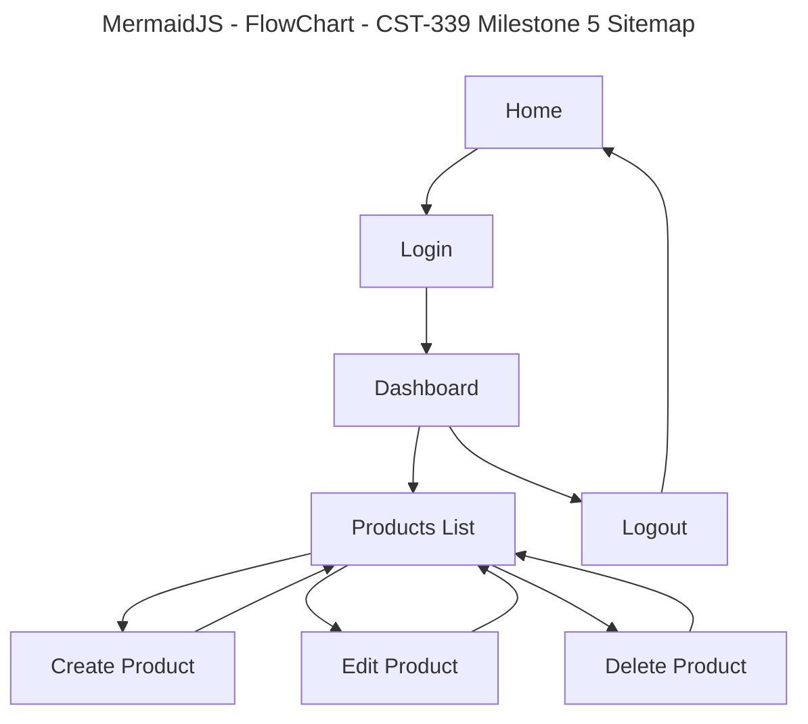

# Grand Canyon University (GCU)

## Programming in Java III CST-339 – Milestone 5

## Project Status and Design Report

### Work Summary and Time Tracking

| User Story                                                     | Team Member | Hours Worked | Hours Remaining |
| -------------------------------------------------------------- | ----------- | -----------: | --------------: |
| Milestone 2: Main App Shell (Home + Navigation)                | Solo        |            4 |               0 |
| Milestone 2: Registration Module (No Database)                 | Solo        |            5 |               0 |
| Milestone 2: Login Module (No Database)                        | Solo        |            5 |               0 |
| Milestone 2: Responsive UI using Bootstrap                     | Solo        |            3 |               0 |
| Milestone 2: Thymeleaf Layouts (Fragments: head/nav/footer)    | Solo        |            3 |               0 |
| Milestone 3: Product Creation Module (Spring MVC, No Database) | Solo        |            5 |               0 |
| Milestone 3: Product List Page (Verification Page)             | Solo        |            2 |               0 |
| Milestone 3: Refactor Auth to Spring Beans + IoC               | Solo        |            3 |               0 |
| Milestone 4: MySQL Database Setup + Schema (USERS, PRODUCTS)   | Solo        |            3 |               0 |
| Milestone 4: Spring Data JDBC Repositories                     | Solo        |            3 |               0 |
| Milestone 4: Persist Users and Products to Database            | Solo        |            4 |               0 |
| Milestone 5: Product Display Module (Database-backed)\*\*      | Solo        |            3 |               0 |
| Milestone 5: Product Update Module (Edit Product)\*\*          | Solo        |            3 |               0 |
| Milestone 5: Product Delete Module\*\*                         | Solo        |            2 |               0 |
| Milestone 5: Controller Routing + View Integration\*\*         | Solo        |            2 |               0 |
| Milestone 5: Debugging + Validation + UI Flow Fixes\*\*        | Solo        |            2 |               0 |

---

## Planning Documentation

### Milestone 5 Objective

For **Milestone 5**, the project extends the database-backed Product module by adding **full CRUD functionality** using **Spring MVC** and **Spring Data JDBC**.

The focus of this milestone is on:

- Displaying products retrieved from the database
- Editing existing product records
- Deleting product records
- Maintaining clean MVC separation and user-friendly navigation

---

## Retrospective Results

### What went well

- Spring Data JDBC made update and delete operations straightforward using repository methods.
- Reusing the existing Products list page allowed update and delete actions to integrate cleanly.
- Thymeleaf form binding worked well for editing product data.

### What was challenging

- Conflicts between JPA and JDBC annotations when both dependencies existed.
- Repository method naming errors that caused application startup failures.
- Ensuring correct routing between list, edit, and delete actions.

### How issues were resolved

- Fully committed to **Spring Data JDBC** for products and removed JPA annotations from entities.
- Simplified repository methods and relied on built-in CRUD operations.
- Verified all controller routes mapped to valid templates.

---

## Design Documentation

### Updated Technical Architecture (Milestone 5)

The application continues to follow a layered design:

### Presentation Layer (View)

- Thymeleaf templates for product list, create, and edit pages
- Bootstrap for responsive layout and consistent UI
- Action buttons for **View / Edit / Delete** operations

### Controller Layer (Spring MVC)

- Handles GET and POST routes for product display, creation, update, and deletion
- Redirects users appropriately after each operation

### Service Layer

- `ProductService` interface and implementation encapsulate business logic
- Controllers do not interact directly with repositories

### Persistence Layer

- **Spring Data JDBC**
- MySQL database with PRODUCTS table
- Repository handles CRUD operations without manual SQL

---

## Database Design (Milestone 5)

### PRODUCTS Table

| Column      | Type        |
| ----------- | ----------- |
| ID          | BIGINT (PK) |
| NAME        | VARCHAR     |
| DESCRIPTION | VARCHAR     |
| PRICE       | DECIMAL     |
| QUANTITY    | INT         |

All product changes persist across application restarts.

---

## Sitemap Diagram (Milestone 5)

### Mermaid Site Map

## How the Pages Interact (Milestone 5)

Home → Register → Register Success  
Home → Login → Dashboard

Dashboard → Products List  
Products List → Create Product → Products List  
Products List → Edit Product → Products List  
Products List → Delete Product → Products List

Dashboard → Logout → Home

---

## Technical Notes (Milestone 5)

- **GET /products**  
  Loads all products from the MySQL database and displays them in a table.

- **GET /products/create**  
  Displays the product creation form.

- **POST /products/create**  
  Validates input and inserts a new product into MySQL, then redirects to `/products`.

- **GET /products/{id}/edit**  
  Loads the selected product from the database and displays it in an edit form.

- **POST /products/{id}/update**  
  Updates the existing product record in MySQL and redirects back to `/products`.

- **POST /products/{id}/delete**  
  Deletes the selected product from the database and redirects back to `/products`.

---

## User Interface Diagram (Milestone 5)

- **Top navigation:**  
  Home | Register | Login | Dashboard | Products | Logout

- **Home page:**  
  Welcome message with navigation links.

- **Register page:**  
  Registration form fields with validation messages.

- **Login page:**  
  Login form fields with validation messages and a global error on failed login.

- **Dashboard page:**  
  Displays session-based user information (name and email).

- **Products list page:**  
  Table of products loaded from the database with **Add**, **Edit**, and **Delete** action buttons.

- **Create product page:**  
  Product form fields with validation messages.

- **Edit product page:**  
  Product form pre-populated with existing data, allowing updates.

---

## Class Diagram (Milestone 5)

### Models (Forms)

- `RegisterForm`
- `LoginForm`
- `ProductForm`

### Controllers

- `HomeController`
- `AuthController`
- `DashboardController`
- `ProductController`

### Service Layer (IoC / Spring Beans)

- `AuthService` (interface)
- `AuthServiceImpl` (implementation / `@Service`)
- `ProductService` (interface)
- `ProductServiceImpl` (implementation / `@Service`)

### Persistence Layer (Spring Data JDBC)

- `UserEntity`
- `ProductEntity`
- `UserRepository`
- `ProductRepository`

---

## Service API Design (Milestone 5)

Not applicable for Milestone 5.

Milestone 5 continues to use **Spring MVC with server-rendered Thymeleaf views**, rather than REST-based APIs.

---

## Security Design (Milestone 5)

Milestone 5 security remains intentionally simplified:

- Authentication uses a **USERS** database table with session attributes.
- Access to Dashboard and Products pages is enforced using session checks.
- Logout invalidates the session.

### Future Enhancements

- Spring Security form-based authentication
- Password hashing
- Role-based access control
- Securing routes using configuration instead of manual session checks

---

## Miscellaneous Notes

- Users and products persist across restarts because storage is handled by **MySQL**.
- Thymeleaf view names must match template file names exactly:
  - If a controller returns `"products"`, the template must be `templates/products.html`
  - If a controller returns `"products/edit"`, the template must be `templates/products/edit.html`
- Ensure the JDBC driver class name is correct:  
  `com.mysql.cj.jdbc.Driver`
- Ensure the database schema name matches the value in `spring.datasource.url`.

---

## Screencast URL

- [My Presentation](https://www.loom.com/share/686a8b7569e64109a15484c5f190c22f)

---
