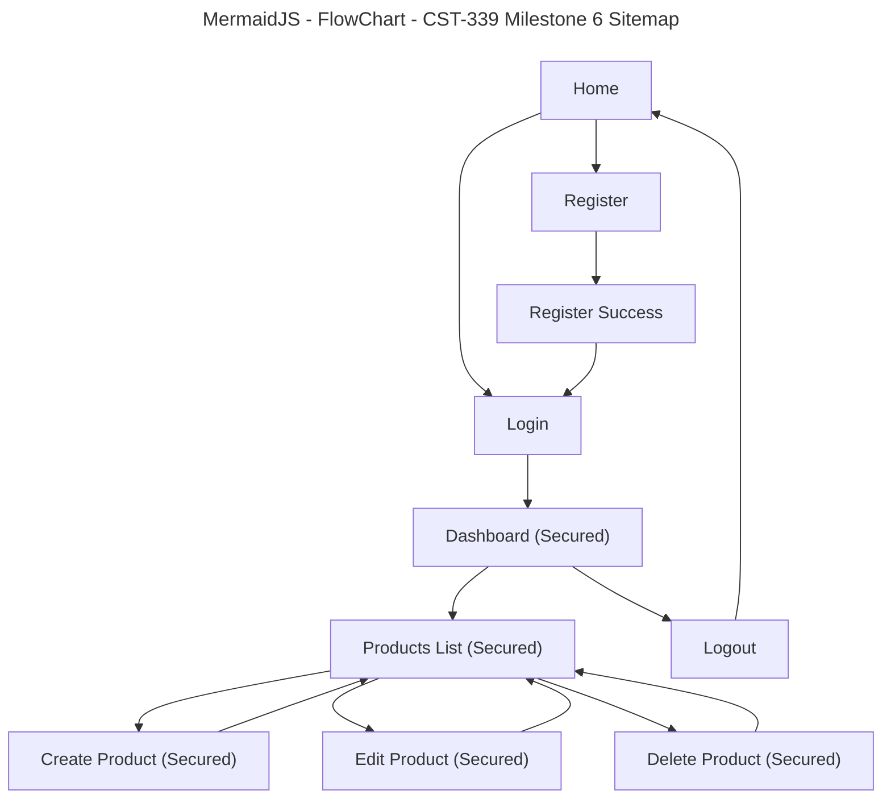

# Grand Canyon University (GCU)

## Programming in Java III CST-339 – Milestone 6

## Project Status and Design Report

### Work Summary and Time Tracking

| User Story                                                     | Team Member | Hours Worked | Hours Remaining |
| -------------------------------------------------------------- | ----------- | -----------: | --------------: |
| Milestone 2: Main App Shell (Home + Navigation)                | Solo        |            4 |               0 |
| Milestone 2: Registration Module (No Database)                 | Solo        |            5 |               0 |
| Milestone 2: Login Module (No Database)                        | Solo        |            5 |               0 |
| Milestone 2: Responsive UI using Bootstrap                     | Solo        |            3 |               0 |
| Milestone 2: Thymeleaf Layouts (Fragments: head/nav/footer)    | Solo        |            3 |               0 |
| Milestone 3: Product Creation Module (Spring MVC, No Database) | Solo        |            5 |               0 |
| Milestone 3: Product List Page (Verification Page)             | Solo        |            2 |               0 |
| Milestone 3: Refactor Auth to Spring Beans + IoC               | Solo        |            3 |               0 |
| Milestone 4: MySQL Database Setup + Schema (USERS, PRODUCTS)   | Solo        |            3 |               0 |
| Milestone 4: Spring Data JDBC Repositories                     | Solo        |            3 |               0 |
| Milestone 4: Persist Users and Products to Database            | Solo        |            4 |               0 |
| Milestone 5: Product Display Module (Database-backed)          | Solo        |            3 |               0 |
| Milestone 5: Product Update Module (Edit Product)              | Solo        |            3 |               0 |
| Milestone 5: Product Delete Module                             | Solo        |            2 |               0 |
| Milestone 5: Controller Routing + View Integration             | Solo        |            2 |               0 |
| Milestone 5: Debugging + Validation + UI Flow Fixes            | Solo        |            2 |               0 |
| Milestone 6: Refactor Login Module to Spring Security          | Solo        |            4 |               0 |
| Milestone 6: Database-backed Authentication                    | Solo        |            3 |               0 |
| Milestone 6: Protect Routes with Security Configuration        | Solo        |            3 |               0 |
| Milestone 6: BCrypt Password Encryption                        | Solo        |            2 |               0 |
| Milestone 6: Logout + Access Control Testing                   | Solo        |            2 |               0 |

---

## Planning Documentation

### Milestone 6 Objective

For **Milestone 6**, the project refactors the authentication system by replacing the previous custom session-based login logic with **Spring Security**.

The focus of this milestone is on:

- Implementing **form-based authentication**
- Authenticating users against the **database**
- Securing all application pages except **Login** and **Registration**
- Encrypting passwords using **BCrypt**
- Centralizing access control through Spring Security configuration

---

## Retrospective Results

### What went well

- Spring Security provided a clean and centralized way to secure the application.
- Database-backed authentication integrated well with the existing `USERS` table.
- BCrypt password hashing improved security and aligned the project more closely with real-world practices.

### What was challenging

- Refactoring from manual session checks to Spring Security required updates in multiple controllers.
- Matching the correct Spring Security version caused some configuration differences, especially with authentication provider setup.
- Existing plain-text users could not log in once BCrypt encoding was enabled.

### How issues were resolved

- Removed manual session validation from controllers and allowed Spring Security to handle access rules.
- Added a custom `UserDetailsService` to load user records from the database.
- Updated registration logic so newly created users are saved with BCrypt-encoded passwords.
- Adjusted `SecurityConfig` to use the correct Spring Security API for the project version.

---

## Design Documentation

### Updated Technical Architecture (Milestone 6)

The application continues to follow a layered design, now with Spring Security integrated into authentication and authorization.

### Presentation Layer (View)

- Thymeleaf templates for home, login, registration, dashboard, and product pages
- Bootstrap for responsive layout and consistent styling
- Login form is now processed through Spring Security
- Logout is triggered using a secured POST action

### Controller Layer (Spring MVC)

- Handles routes for public pages such as Home, Login, and Registration
- Handles routes for Dashboard and Product features after authentication
- Controllers no longer manually check session state for secured pages

### Service Layer

- `ProductService` interface and implementation encapsulate product business logic
- `CustomUserDetailsService` loads user credentials and roles from the database for Spring Security
- Registration logic now encrypts passwords before saving users

### Persistence Layer

- **Spring Data JDBC**
- MySQL database with `USERS` and `PRODUCTS` tables
- `UserRepository` is used by both registration and authentication
- `ProductRepository` continues to provide CRUD operations for products

### Security Layer

- **Spring Security**
- Form-based login
- BCrypt password encoding
- Route protection configured in `SecurityConfig`

---

## Database Design (Milestone 6)

### USERS Table

| Column    | Type        |
| --------- | ----------- |
| ID        | BIGINT (PK) |
| USERNAME  | VARCHAR     |
| PASSWORD  | VARCHAR     |
| EMAIL     | VARCHAR     |
| FIRSTNAME | VARCHAR     |
| LASTNAME  | VARCHAR     |

### PRODUCTS Table

| Column      | Type        |
| ----------- | ----------- |
| ID          | BIGINT (PK) |
| NAME        | VARCHAR     |
| DESCRIPTION | VARCHAR     |
| PRICE       | DECIMAL     |
| QUANTITY    | INT         |

### Database Notes

- User passwords are now stored as **BCrypt hashes** instead of plain text.
- Products continue to persist across application restarts using MySQL.

---

## Sitemap Diagram (Milestone 6)

### Mermaid Site Map

## How the Pages Interact (Milestone 6)

Home → Register → Register Success → Login  
Home → Login → Dashboard

Dashboard → Products List  
Products List → Create Product → Products List  
Products List → Edit Product → Products List  
Products List → Delete Product → Products List

Dashboard → Logout → Home

### Route Protection Rules

- **Public pages:** Home, Login, Register, Register Success
- **Secured pages:** Dashboard, Products, Create Product, Edit Product, Delete Product
- If a user tries to access a secured page without logging in, they are redirected to the **Login** page

---

## Technical Notes (Milestone 6)

- **GET /login**  
  Displays the custom login page used by Spring Security.

- **POST /login**  
  Handled by Spring Security to authenticate the user against the database.

- **GET /register**  
  Displays the registration form.

- **POST /register**  
  Validates input, encrypts the password using BCrypt, and saves the user to the `USERS` table.

- **GET /dashboard**  
  Displays the secured dashboard page after successful authentication.

- **GET /products**  
  Loads all products from the MySQL database and displays them in a secured table view.

- **GET /products/create**  
  Displays the secured product creation form.

- **POST /products/create**  
  Validates input and inserts a new product into MySQL, then redirects to `/products`.

- **GET /products/{id}/edit**  
  Loads the selected product and displays it in a secured edit form.

- **POST /products/{id}/update**  
  Updates the selected product record and redirects back to `/products`.

- **POST /products/{id}/delete**  
  Deletes the selected product and redirects back to `/products`.

- **POST /logout**  
  Ends the authenticated session and redirects the user to the Home page.

---

## User Interface Diagram (Milestone 6)

- **Top navigation:**  
  Home | Register | Login | Dashboard | Products | Logout

- **Home page:**  
  Welcome message with public navigation links.

- **Register page:**  
  Registration form fields with validation messages. New passwords are encrypted before storage.

- **Login page:**  
  Custom Spring Security login form. Invalid credentials display an error.

- **Dashboard page:**  
  Displays authenticated user information from the database.

- **Products list page:**  
  Table of products loaded from the database with **Add**, **Edit**, and **Delete** action buttons. Access is restricted to authenticated users.

- **Create product page:**  
  Secured product form fields with validation messages.

- **Edit product page:**  
  Secured product form pre-populated with existing data for updates.

---

## Class Diagram (Milestone 6)

### Models (Forms)

- `RegisterForm`
- `LoginForm`
- `ProductForm`

### Controllers

- `HomeController`
- `AuthController`
- `DashboardController`
- `ProductController`

### Service Layer (IoC / Spring Beans)

- `ProductService` (interface)
- `ProductServiceImpl` (implementation / `@Service`)
- `CustomUserDetailsService` (implementation / `@Service`)

### Persistence Layer (Spring Data JDBC)

- `UserEntity`
- `ProductEntity`
- `UserRepository`
- `ProductRepository`

### Security Layer

- `SecurityConfig`
- `PasswordEncoder` bean
- `DaoAuthenticationProvider`

---

## Service API Design (Milestone 6)

Not applicable for Milestone 6.

Milestone 6 continues to use **Spring MVC with server-rendered Thymeleaf views**, rather than REST-based APIs.

---

## Security Design (Milestone 6)

Milestone 6 introduces a full Spring Security-based authentication design:

- Authentication uses **Spring Security form-based login**
- Users are authenticated against the **USERS** table in MySQL
- Passwords are stored using **BCrypt hashing**
- All routes are secured except:
  - `/login`
  - `/register`
  - `/register/success`
  - public static resources (if applicable)
- Access control is managed through `SecurityConfig` instead of manual session checks
- Logout is handled by Spring Security and invalidates the authenticated session

### Security Improvements Over Milestone 5

- Replaced manual session-based login logic
- Centralized authentication and authorization
- Improved password storage security
- Simplified controller code by removing repeated access checks

### Future Enhancements

- Role-based authorization (e.g., ADMIN vs USER)
- Stronger validation and duplicate-user checks
- CSRF review and additional production hardening
- Custom access denied page

---

## Miscellaneous Notes

- Users and products persist across restarts because storage is handled by **MySQL**.
- Passwords must be stored as **BCrypt hashes** for login to succeed under Spring Security.
- Thymeleaf view names must match template file names exactly:
  - If a controller returns `"products"`, the template must be `templates/products.html`
  - If a controller returns `"products/edit"`, the template must be `templates/products/edit.html`
- Ensure the JDBC driver class name is correct:  
  `com.mysql.cj.jdbc.Driver`
- Ensure the database schema name matches the value in `spring.datasource.url`.
- If older users were saved with plain-text passwords before Milestone 6, they may need to be recreated or updated because Spring Security now expects encrypted passwords.

---

## Screencast URL

- [My Presentation](https://www.loom.com/share/b6e714439c6645faacd04e986da905a7)
