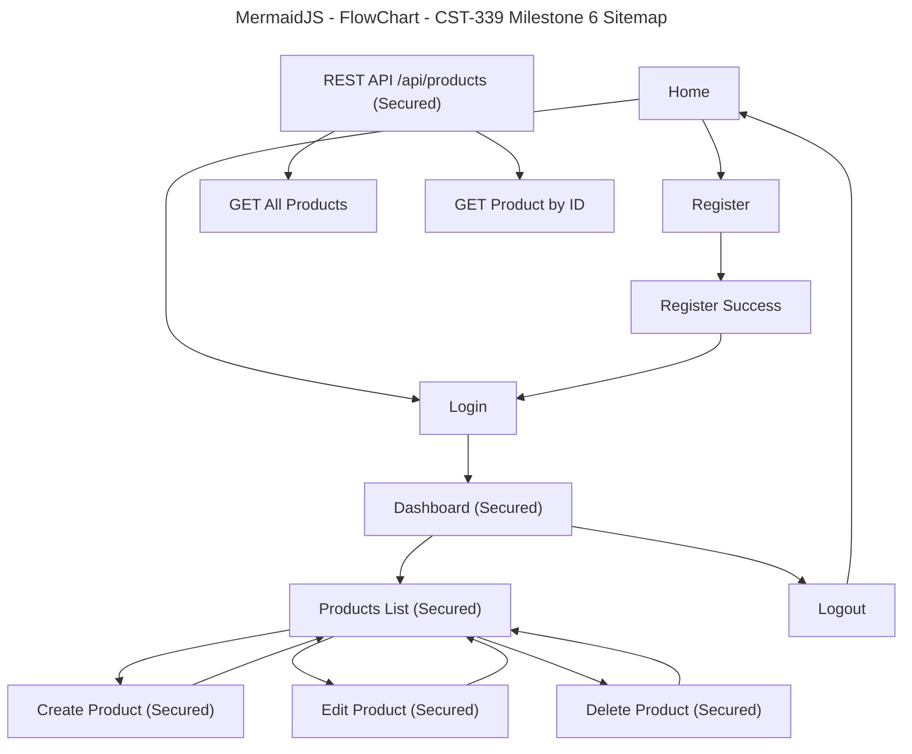

# Grand Canyon University (GCU)

## Programming in Java III CST-339 – Milestone 8

## Final Project Status and Design Report

This report has been updated for **Milestone 8** to include the **final application code**, **JavaDoc generation**, **final project presentation**, and the **final design report** for the completed enterprise N-layer application.

---

## Work Summary and Time Tracking

| User Story                                                     | Team Member | Hours Worked | Hours Remaining |
| -------------------------------------------------------------- | ----------- | -----------: | --------------: |
| Milestone 2: Main App Shell (Home + Navigation)                | Solo        |            4 |               0 |
| Milestone 2: Registration Module (No Database)                 | Solo        |            5 |               0 |
| Milestone 2: Login Module (No Database)                        | Solo        |            5 |               0 |
| Milestone 2: Responsive UI using Bootstrap                     | Solo        |            3 |               0 |
| Milestone 2: Thymeleaf Layouts (Fragments: head/nav/footer)    | Solo        |            3 |               0 |
| Milestone 3: Product Creation Module (Spring MVC, No Database) | Solo        |            5 |               0 |
| Milestone 3: Product List Page (Verification Page)             | Solo        |            2 |               0 |
| Milestone 3: Refactor Auth to Spring Beans + IoC               | Solo        |            3 |               0 |
| Milestone 4: MySQL Database Setup + Schema (USERS, PRODUCTS)   | Solo        |            3 |               0 |
| Milestone 4: Spring Data JDBC Repositories                     | Solo        |            3 |               0 |
| Milestone 4: Persist Users and Products to Database            | Solo        |            4 |               0 |
| Milestone 5: Product Display Module (Database-backed)          | Solo        |            3 |               0 |
| Milestone 5: Product Update Module (Edit Product)              | Solo        |            3 |               0 |
| Milestone 5: Product Delete Module                             | Solo        |            2 |               0 |
| Milestone 5: Controller Routing + View Integration             | Solo        |            2 |               0 |
| Milestone 5: Debugging + Validation + UI Flow Fixes            | Solo        |            2 |               0 |
| Milestone 6: Refactor Login Module to Spring Security          | Solo        |            4 |               0 |
| Milestone 6: Database-backed Authentication                    | Solo        |            3 |               0 |
| Milestone 6: Protect Routes with Security Configuration        | Solo        |            3 |               0 |
| Milestone 6: BCrypt Password Encryption                        | Solo        |            2 |               0 |
| Milestone 6: Logout + Access Control Testing                   | Solo        |            2 |               0 |
| Milestone 7: REST API 1 - Return All Products                  | Solo        |            3 |               0 |
| Milestone 7: REST API 2 - Return Desired Product               | Solo        |            2 |               0 |
| Milestone 7: Secure REST APIs with HTTP Basic                  | Solo        |            3 |               0 |
| Milestone 7: Design Cleanup + Updated Report                   | Solo        |            3 |               0 |
| Milestone 8: JavaDoc Generation                                | Solo        |            2 |               0 |
| Milestone 8: Final Application Code Review and Cleanup         | Solo        |            3 |               0 |
| Milestone 8: Final Project Presentation                        | Solo        |            3 |               0 |
| Milestone 8: Final Design Report Update                        | Solo        |            3 |               0 |

---

## Planning Documentation

### Milestone 8 Objective

For **Milestone 8**, the project is finalized as a complete **enterprise N-layer Spring Boot application**. This milestone focuses on packaging the finished system, documenting the codebase with **JavaDoc**, completing the **final presentation**, and submitting the **final design report**.

The main goals of this milestone are:

- Finalize the complete application code
- Generate **JavaDoc** documentation for the Java classes and methods
- Prepare the **final project presentation**
- Update the **final design report**
- Review and clean up the application structure and documentation
- Present the completed enterprise application as the final milestone submission

---

## Retrospective Results

### What went well

- The layered architecture remained consistent across all milestones.
- The project successfully evolved from a simple Spring Boot shell into a secure enterprise application.
- Spring Security, MySQL persistence, and REST APIs integrated well into the final design.
- The project documentation from earlier milestones made the final report easier to complete.
- The final presentation clearly demonstrates the technical growth of the application.

### What was challenging

- Maintaining consistency across multiple milestones required careful updates to documentation.
- JavaDoc generation required reviewing class and method structure more closely.
- Final cleanup required checking that the web application, persistence layer, security layer, and REST APIs all aligned with the report.
- Presenting the full project in a short screencast required summarizing only the most important technical details.

### How issues were resolved

- Reviewed the project milestone history and consolidated the design into one final report.
- Added or improved JavaDoc-style comments for major classes and methods.
- Reused the Milestone 7 report as the foundation for the Milestone 8 final documentation.
- Focused the presentation on project objectives, architecture, OOP design, security, teamwork, and demonstration.

---

## Design Documentation

### Updated Technical Architecture (Milestone 8)

The application follows a layered enterprise design using **Spring Boot**, **Spring MVC**, **Spring Security**, **Spring Data JDBC**, and **MySQL**.  
By Milestone 8, the project is presented as the **completed final application**, including the secured MVC web application, secured REST API layer, persistence layer, and full supporting documentation.

### Presentation Layer (View)

- Thymeleaf templates for home, login, registration, dashboard, and product pages
- Bootstrap for responsive layout and consistent styling
- Login form is processed through Spring Security
- Logout is handled through Spring Security
- Web pages use server-rendered HTML views

### Controller Layer

- MVC controllers handle page navigation and product form workflows
- REST controller handles API routes for products
- Web and API responsibilities remain separated for cleaner design

### Service Layer

- `ProductService` and `ProductServiceImpl` encapsulate product business logic
- `CustomUserDetailsService` loads users from the database for authentication
- Registration logic encrypts passwords before saving them

### Persistence Layer

- **Spring Data JDBC**
- MySQL database with `USERS` and `PRODUCTS` tables
- `UserRepository` supports registration and authentication
- `ProductRepository` supports CRUD operations for products

### Security Layer

- **Spring Security**
- Form-based login for web pages
- Basic HTTP Authentication for REST APIs
- BCrypt password encoding
- Separate security rules for MVC routes and API routes
- Authentication uses the existing `USERS` table

### Documentation Layer

- Java source code is documented using **JavaDoc**
- JavaDoc output provides developer-friendly documentation for classes and methods
- Final report and presentation summarize the complete project lifecycle from Milestone 1 through Milestone 8

---

## Database Design (Milestone 8)

### USERS Table

| Column    | Type        |
| --------- | ----------- |
| ID        | BIGINT (PK) |
| USERNAME  | VARCHAR     |
| PASSWORD  | VARCHAR     |
| EMAIL     | VARCHAR     |
| FIRSTNAME | VARCHAR     |
| LASTNAME  | VARCHAR     |

### PRODUCTS Table

| Column      | Type        |
| ----------- | ----------- |
| ID          | BIGINT (PK) |
| NAME        | VARCHAR     |
| DESCRIPTION | VARCHAR     |
| PRICE       | DECIMAL     |
| QUANTITY    | INT         |

### Database Notes

- User passwords are stored as **BCrypt hashes**
- Products are stored in MySQL and persist across application restarts
- REST API authentication uses the same user records as the web login system
- The database-backed design supports both the secured web application and the secured REST API layer

---

## Sitemap Diagram (Milestone 8)

### Mermaid Site Map

<details>



</details>

## How the Pages and APIs Interact (Milestone 8)

Home → Register → Register Success → Login  
Home → Login → Dashboard

Dashboard → Products List  
Products List → Create Product → Products List  
Products List → Edit Product → Products List  
Products List → Delete Product → Products List

Dashboard → Logout → Home

External Client / Postman / Browser → Basic Auth → `/api/products`  
External Client / Postman / Browser → Basic Auth → `/api/products/{id}`

### Route Protection Rules

- **Public pages:** Home, Login, Register, Register Success
- **Secured web pages:** Dashboard, Products, Create Product, Edit Product, Delete Product
- **Secured API routes:** `/api/**`
- If a user tries to access a secured web page without logging in, they are redirected to the **Login** page
- If a client tries to access a secured API route without valid Basic Auth credentials, access is denied

---

## Technical Notes (Milestone 8)

- **GET /login**  
  Displays the custom login page used by Spring Security.

- **POST /login**  
  Handled by Spring Security to authenticate the user against the database.

- **GET /register**  
  Displays the registration form.

- **POST /register**  
  Validates input, encrypts the password using BCrypt, and saves the user to the `USERS` table.

- **GET /dashboard**  
  Displays the secured dashboard page after successful authentication.

- **GET /products**  
  Loads all products from the MySQL database and displays them in a secured table view.

- **GET /products/create**  
  Displays the secured product creation form.

- **POST /products/create**  
  Validates input and inserts a new product into MySQL, then redirects to `/products`.

- **GET /products/{id}/edit**  
  Loads the selected product and displays it in a secured edit form.

- **POST /products/{id}/update**  
  Updates the selected product record and redirects back to `/products`.

- **POST /products/{id}/delete**  
  Deletes the selected product and redirects back to `/products`.

- **POST /logout**  
  Ends the authenticated session and redirects the user to the Home page.

- **GET /api/products**  
  Returns all products from the MySQL database as JSON or XML. Requires Basic HTTP Authentication.

- **GET /api/products/{id}**  
  Returns a single product by ID as JSON or XML. Requires Basic HTTP Authentication. Returns `404 Not Found` if the product does not exist.

---

## User Interface Diagram (Milestone 8)

- **Top navigation:**  
  Home | Register | Login | Dashboard | Products | Logout

- **Home page:**  
  Welcome message with public navigation links.

- **Register page:**  
  Registration form fields with validation messages. Passwords are encrypted before storage.

- **Login page:**  
  Custom Spring Security login form. Invalid credentials display an error.

- **Dashboard page:**  
  Displays authenticated user information from the database.

- **Products list page:**  
  Table of products loaded from the database with **Add**, **Edit**, and **Delete** action buttons. Access is restricted to authenticated users.

- **Create product page:**  
  Secured product form fields with validation messages.

- **Edit product page:**  
  Secured product form pre-populated with existing data for updates.

- **REST API interface:**  
  Product data can also be accessed through `/api/products` and `/api/products/{id}` using Basic HTTP Authentication in tools such as Postman, curl, or the browser.

---

## Class Diagram (Milestone 7)

### Models (Forms / Response Models)

- `RegisterForm`
- `LoginForm`
- `ProductForm`
- `ProductListResponse`

### Controllers

- `HomeController`
- `AuthController`
- `DashboardController`
- `ProductController`
- `ProductRestController`

### Service Layer (IoC / Spring Beans)

- `ProductService` (interface)
- `ProductServiceImpl` (implementation / `@Service`)
- `CustomUserDetailsService` (implementation / `@Service`)

### Persistence Layer (Spring Data JDBC)

- `UserEntity`
- `ProductEntity`
- `UserRepository`
- `ProductRepository`

### Security Layer

- `SecurityConfig`
- `PasswordEncoder` bean
- `DaoAuthenticationProvider`
- Separate `SecurityFilterChain` definitions for:
  - web form login
  - REST API Basic Auth

---

## REST API Design (Milestone 8)

### Authentication

All REST endpoints under `/api/**` are protected with **Basic HTTP Authentication** through Spring Security.  
The credentials are validated against the `USERS` table using the existing `CustomUserDetailsService` and `BCryptPasswordEncoder`.

### REST API 1: Return All Products

- **Method:** `GET`
- **Endpoint:** `/api/products`
- **Security:** Basic HTTP Authentication required
- **Response Types:** JSON or XML
- **Success Code:** `200 OK`

#### Example JSON Response

```json
{
  "products": [
    {
      "id": 1,
      "name": "Apple",
      "description": "Tasty fruit that is crunchy yet sweet!",
      "price": 1.0,
      "quantity": 20
    },
    {
      "id": 2,
      "name": "Bananas",
      "description": "	Tasty fruit with great potassium",
      "price": 1.5,
      "quantity": 10
    }
  ]
}
```

### REST API 2: Return Desired Product

- **Method:** `GET`
- **Endpoint:** `/api/products/{id}`, in this case we chosen ID: 1
- **Security:** Basic HTTP Authentication required
- **Response Types:** JSON or XML
- **Success Code:** `200 OK`
- **Error Code:** `404 Not Found` when the product ID does not exist

#### Example JSON Response

```json
{
  "id": 1,
  "name": "Apple",
  "description": "Tasty fruit that is crunchy yet sweet!",
  "price": 1.0,
  "quantity": 20
}
```

### Postman / Browser Test Notes

- Use a registered database user account created from the web registration page or inserted directly into the `USERS` table with a BCrypt password.
- Send the `Authorization: Basic ...` header automatically through Postman Basic Auth settings.
- Use the `Accept: application/json` header for JSON or `Accept: application/xml` for XML.

---

## Security Design (Milestone 8)

Milestone 7 extends the Milestone 6 security design by protecting both the web application and the REST API layer.

### Web Security

- Authentication uses Spring Security form-based login
- Users are authenticated against the `USERS` table in MySQL
- Passwords are stored using BCrypt hashing
- Web pages such as Dashboard and Products remain protected

### API Security

- All `/api/**` routes require Basic HTTP Authentication
- API credentials are validated against the same `USERS` table
- API security is configured separately from MVC page security
- API access is intended for external tools such as Postman, curl, or browser-based testing

### Security Improvements Over Milestone 6

- Added security rules specifically for REST API endpoints
- Reused the existing database-backed authentication design
- Kept web login and API login responsibilities separated
- Improved architecture by using distinct security chains for different route types

### Future Enhancements

- Role-based authorization such as `ADMIN` and `USER`
- Token-based API authentication such as JWT
- Stronger duplicate-user validation and password policies
- Custom unauthorized and access-denied responses
- Production hardening for REST API error handling

## Code Cleanup Summary (Milestone 8)

- Added a dedicated REST controller: `ProductRestController`
- Added a response wrapper model for cleaner XML output: `ProductListResponse`
- Updated `SecurityConfig` to separate web login and API Basic Auth security chains
- Reused the existing database-backed authentication components instead of duplicating login logic
- Preserved the existing MVC product pages and form-login experience

---

## Technical Notes (Milestone 8)

- **GET /api/products**  
  Returns all products from the MySQL database as JSON or XML. Requires Basic HTTP Authentication.

- **GET /api/products/{id}**  
  Returns a single product by ID as JSON or XML. Requires Basic HTTP Authentication. Returns `404 Not Found` when the product does not exist.

- **Security behavior**  
  `/api/**` uses stateless Basic HTTP Authentication, while the web pages continue using the existing custom form login.

---

## Screencast URL

- [My Presentation](https://www.loom.com/share/efe6c3304d2c4073a7228fdd742802cb)
